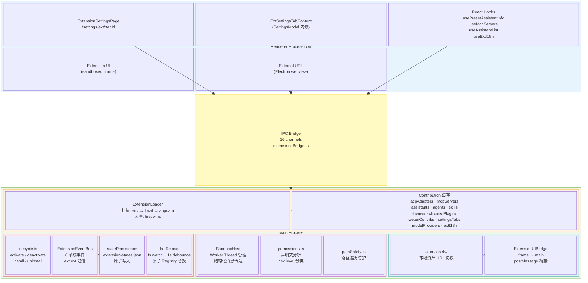
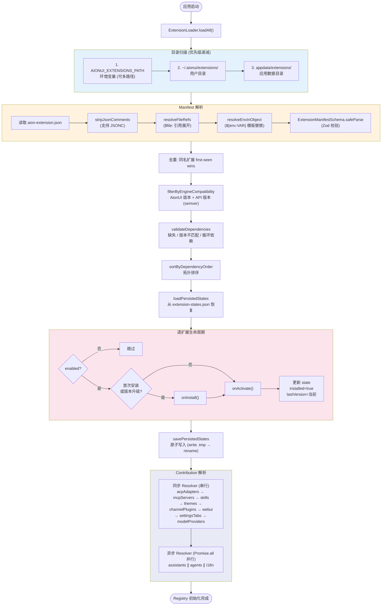
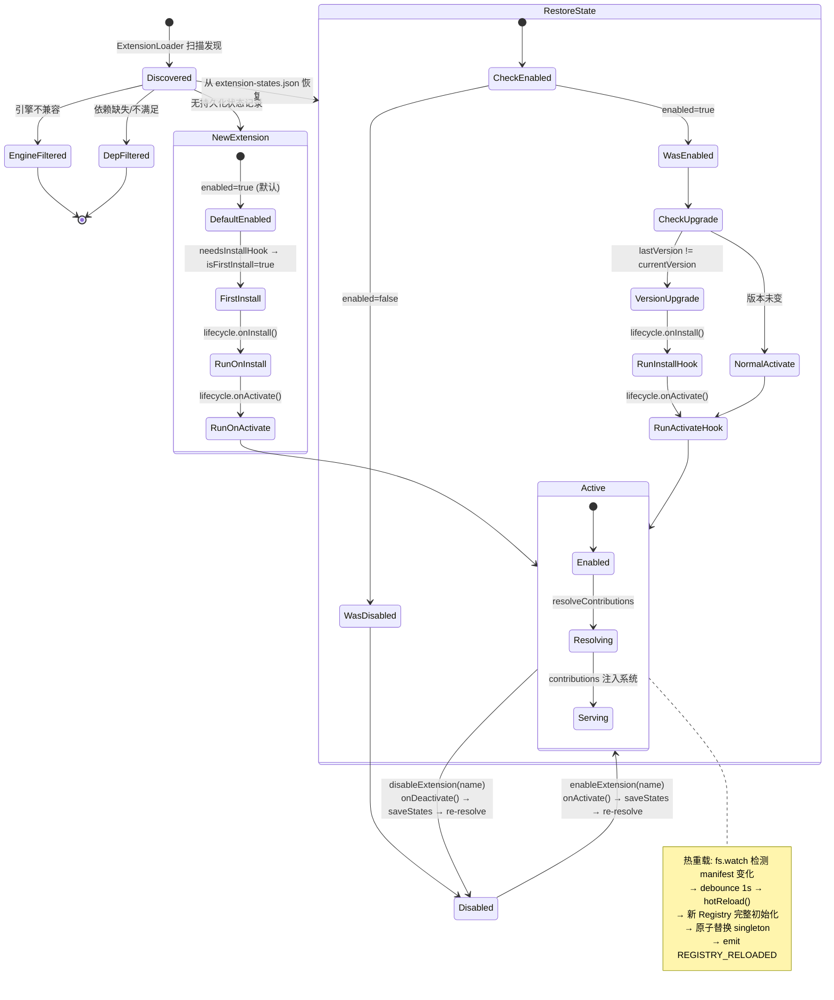
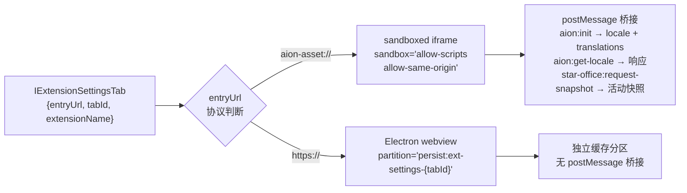

# Extension 系统 — 架构详解

> 日期：2026-03-30
> 关联：[README.md](README.md) · [contribution-types.md](contribution-types.md) · [security-model.md](security-model.md) · [gap-analysis.md](gap-analysis.md)

## 1. 整体架构图



## 2. 初始化管线



> **Resolve 策略说明:** 每个 resolver 遍历所有 enabled extensions（按 contribution 类型聚合，不是按扩展逐个解析）。同步 resolver 串行执行（因为 `resolveThemes` 用 `readFileSync`，`resolveChannelPlugins` 用 `eval('require')`）；异步 resolver 用 `Promise.all` 并行（因为 `resolveAssistants` / `resolveAgents` 用 `fs.readFile`，`resolveExtensionI18n` 读 locale JSON）。

## 3. 生命周期状态机



## 4. IPC 通道清单

Extension 系统通过 `extensionsBridge.ts` 暴露 16 个 IPC 通道：

### 4.1 只读查询 (11 个)

| 通道                                     | 输入         | 输出                                     | 用途                                         |
| ---------------------------------------- | ------------ | ---------------------------------------- | -------------------------------------------- |
| `extensions.get-themes`                  | void         | `ICssTheme[]`                            | CSS 主题                                     |
| `extensions.get-loaded-extensions`       | void         | `IExtensionInfo[]`                       | 扩展列表 (name, version, enabled, riskLevel) |
| `extensions.get-assistants`              | void         | `Record<string, unknown>[]`              | 助手预设                                     |
| `extensions.get-agents`                  | void         | `Record<string, unknown>[]`              | Agent 预设                                   |
| `extensions.get-acp-adapters`            | void         | `Record<string, unknown>[]`              | ACP 适配器                                   |
| `extensions.get-mcp-servers`             | void         | `Record<string, unknown>[]`              | MCP 服务器                                   |
| `extensions.get-skills`                  | void         | `Array<{ name, description, location }>` | Skill 文件                                   |
| `extensions.get-settings-tabs`           | void         | `IExtensionSettingsTab[]`                | 设置 Tab                                     |
| `extensions.get-webui-contributions`     | void         | `IExtensionWebuiContribution[]`          | WebUI 路由/资产                              |
| `extensions.get-agent-activity-snapshot` | void         | `IExtensionAgentActivitySnapshot`        | Agent 活动快照 (3s TTL 缓存)                 |
| `extensions.get-ext-i18n-for-locale`     | `{ locale }` | `Record<string, unknown>`                | 扩展 i18n 翻译                               |

### 4.2 管理操作 (4 个)

| 通道                         | 输入                | 输出                            | 用途     |
| ---------------------------- | ------------------- | ------------------------------- | -------- |
| `extensions.enable`          | `{ name }`          | `IBridgeResponse`               | 启用扩展 |
| `extensions.disable`         | `{ name, reason? }` | `IBridgeResponse`               | 禁用扩展 |
| `extensions.get-permissions` | `{ name }`          | `IExtensionPermissionSummary[]` | 权限摘要 |
| `extensions.get-risk-level`  | `{ name }`          | `string`                        | 风险等级 |

### 4.3 推送事件 (1 个)

| 通道                       | 方向          | 载荷                         | 用途              |
| -------------------------- | ------------- | ---------------------------- | ----------------- |
| `extensions.state-changed` | main→renderer | `{ name, enabled, reason? }` | 扩展启用/禁用通知 |

## 5. 渲染层交互

### 5.1 Extension Settings Tab 渲染策略

渲染器对扩展设置 Tab 采用双分支渲染：



### 5.2 位置锚定系统

扩展设置 Tab 支持相对于内置 Tab 的位置锚定：

```
内置 Tab 序列: gemini | model | agent | tools | display | webui | system | about

position: { anchor: "tools", placement: "after" }
  → 插入到 tools 之后

position: { anchor: "ext-other-tab-id", placement: "before" }
  → 支持跨扩展锚定

无 position 声明
  → 默认插入到 system 之前
```

## 6. 目录结构

```
src/process/extensions/
├── index.ts                          公开 API barrel export
├── types.ts                          Zod schemas + TypeScript 类型 (522 行)
├── constants.ts                      路径、环境变量、manifest 文件名
├── ExtensionLoader.ts                目录扫描、manifest 加载/验证
├── ExtensionRegistry.ts              Singleton 注册中心: init, resolve, enable/disable
├── lifecycle/
│   ├── lifecycle.ts                  activate/deactivate/uninstall 钩子执行
│   ├── ExtensionEventBus.ts          全局事件总线 (跨扩展通信)
│   ├── statePersistence.ts           enabled/disabled 状态持久化 (JSON)
│   └── hotReload.ts                  FSWatcher 热重载
├── sandbox/
│   ├── sandbox.ts                    SandboxHost: Worker Thread 隔离 + 消息路由
│   ├── sandboxWorker.ts              Worker 脚本: aion API proxy + callMainThread
│   ├── ExtensionStorage.ts           扩展 KV 存储 (JSON 文件, 按扩展隔离)
│   ├── permissions.ts                权限分析、风险等级分类
│   └── pathSafety.ts                 路径遍历防护
├── protocol/
│   ├── assetProtocol.ts              aion-asset:// 自定义协议
│   └── uiProtocol.ts                 iframe ↔ main 消息协议
└── resolvers/
    ├── AcpAdapterResolver.ts         ACP Agent 适配器
    ├── AssistantResolver.ts          助手 + Agent 预设
    ├── ChannelPluginResolver.ts      消息渠道插件 (duck-typing)
    ├── I18nResolver.ts               扩展 i18n 国际化
    ├── McpServerResolver.ts          MCP 服务器
    ├── ModelProviderResolver.ts      模型提供商
    ├── SettingsTabResolver.ts        设置 Tab (位置锚定)
    ├── SkillResolver.ts              Skill markdown 文件
    ├── ThemeResolver.ts              CSS 主题
    ├── WebuiResolver.ts              WebUI 路由/资产
    └── utils/
        ├── entryPointResolver.ts     dist-first 入口点回退
        ├── envResolver.ts            ${env:VAR} 模板解析
        ├── dependencyResolver.ts     依赖校验 + 拓扑排序
        ├── engineValidator.ts        AionUI 版本 + API 版本兼容性
        └── fileResolver.ts           $file: 引用解析
```
