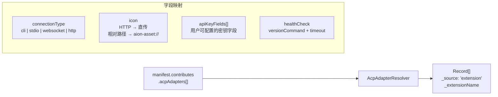
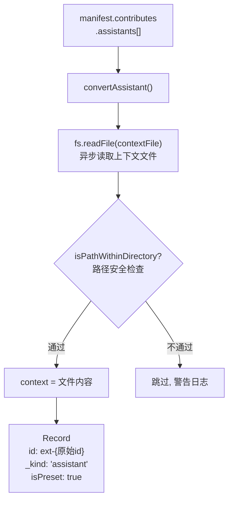
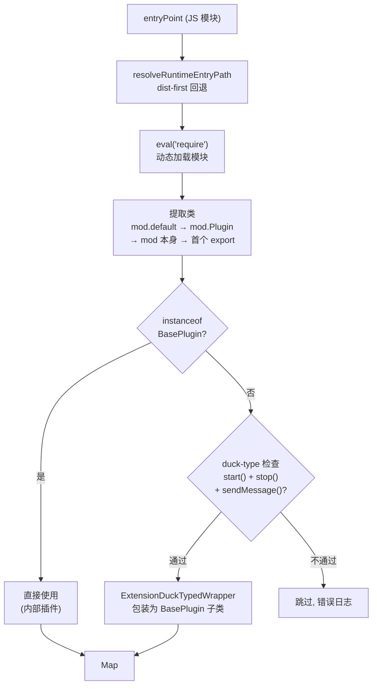

# Extension 系统 — Contribution 类型速查

> 日期：2026-03-30
> 关联：[README.md](README.md) · [architecture.md](architecture.md)

## 速查总表

| #   | 类型             | Hub 映射      | ID 规则            | 解析方式                  | 备注                                    |
| --- | ---------------- | ------------- | ------------------ | ------------------------- | --------------------------------------- |
| 1   | `acpAdapters`    | Agent Hub     | 原始 `id`          | 同步, 平铺                | icon→aion-asset://, connectionType 分支 |
| 2   | `mcpServers`     | MCP Hub       | `ext-{ext}-{name}` | 同步, 平铺                | transport 4 种类型, 保留 originalJson   |
| 3   | `assistants`     | Assistant Hub | `ext-{id}`         | **异步**, 读文件          | 读 contextFile 内容, path 安全检查      |
| 4   | ~~`agents`~~     | —             | `ext-{id}`         | **异步**, 读文件          | **冗余, 待废弃** — 见下方分析           |
| 5   | `skills`         | Skill Hub     | 原始 `name`        | 同步, 仅验证路径          | 不读文件, 只验证存在性                  |
| 6   | `themes`         | Theme Hub     | `ext-{ext}-{id}`   | 同步, **readFileSync**    | 内联 CSS 内容, cover→aion-asset://      |
| 7   | `channelPlugins` | Channel Hub   | `type`             | 同步, **dynamic require** | duck-typing + wrapper, eval('require')  |
| 8   | `webui`          | —             | 路径命名空间       | 同步, 路径校验            | 强制 `/{extName}/` 前缀, 保留路径黑名单 |
| 9   | `settingsTabs`   | —             | `ext-{ext}-{id}`   | 同步, URL 解析            | 位置锚定系统 (anchor + before/after)    |
| 10  | `modelProviders` | Model Hub     | `ext-{ext}-{id}`   | 同步, logo 解析           | 强类型输出 ResolvedModelProvider        |

## 各类型详解

### 1. ACP Adapters — Agent 连接适配器

**Resolver:** `AcpAdapterResolver.ts` (57 行)
**Schema:** `ExtAcpAdapterSchema`

**关键字段:**

| 字段             | 必填            | 说明                                     |
| ---------------- | --------------- | ---------------------------------------- |
| `id`             | 是              | 适配器唯一 ID                            |
| `name`           | 是              | 显示名称                                 |
| `connectionType` | 否 (默认 `cli`) | `cli` / `stdio` / `websocket` / `http`   |
| `cliCommand`     | 条件            | cli/stdio 类型必填 (或 `defaultCliPath`) |
| `endpoint`       | 条件            | websocket/http 类型必填                  |
| `apiKeyFields[]` | 否              | 用户在 Settings UI 配置的密钥字段        |
| `models[]`       | 否              | 支持的模型列表                           |
| `yoloMode`       | 否              | 自动确认模式 (`session` / `global`)      |
| `healthCheck`    | 否              | 健康检查命令                             |

**约束:** cli/stdio 需要 `cliCommand` 或 `defaultCliPath`; websocket/http 需要 `endpoint`。

---

### 2. MCP Servers — MCP 服务器

**Resolver:** `McpServerResolver.ts` (35 行)
**Schema:** `ExtMcpServerSchema` + `ExtMcpTransportSchema` (discriminated union)

**Transport 类型:**

| Transport         | 必填字段                   |
| ----------------- | -------------------------- |
| `stdio`           | `command`, `args?`, `env?` |
| `sse`             | `url`, `headers?`          |
| `http`            | `url`, `headers?`          |
| `streamable_http` | `url`, `headers?`          |

**解析逻辑:**

- ID 生成: `ext-{extensionName}-{serverName}`
- 自动添加 `createdAt` / `updatedAt` 时间戳
- 保留 `originalJson` (原始配置的 JSON 字符串, 用于调试)
- 最简单的 resolver — 基本是数据透传 + ID 生成

---

### 3. Assistants — 助手预设

**Resolver:** `AssistantResolver.ts` (114 行)
**Schema:** `ExtAssistantSchema`

**关键字段:**

| 字段              | 必填 | 说明                                                                          |
| ----------------- | ---- | ----------------------------------------------------------------------------- |
| `id`              | 是   | 助手 ID (输出时加 `ext-` 前缀)                                                |
| `name`            | 是   | 显示名称                                                                      |
| `presetAgentType` | 是   | 内置类型 (`gemini`/`claude`/`codex`/`codebuddy`/`opencode`) 或扩展 adapter ID |
| `contextFile`     | 是   | 上下文文件相对路径 (**resolve 时读取内容**)                                   |
| `models[]`        | 否   | 推荐模型列表                                                                  |
| `enabledSkills[]` | 否   | 启用的 skill 名称                                                             |
| `prompts[]`       | 否   | 提示词列表                                                                    |
| `avatar`          | 否   | 头像路径 (aion-asset:// 或 HTTP)                                              |

**特殊:** 这是少数异步 resolver 之一, 因为需要读取 contextFile 文件内容。

---

### 4. ~~Agents~~ — 冗余, 待废弃

> **结论:** `agents` 与 `assistants` 使用完全相同的 Schema、共用同一个 resolver 函数，唯一区别是输出带 `_kind: 'agent'` 标记。目前既没有功能差异，也没有 UI 差异，是冗余的。

**Resolver:** `AssistantResolver.ts` (共用 `convertAssistant`)
**Schema:** 与 `assistants` 完全相同 (`ExtAssistantSchema`)

**现状:**

- 与 assistants 共用同一个转换函数 `convertAssistant(ext, kind='agent')`
- 输出带 `_kind: 'agent'` 标记 (assistants 为 `_kind: 'assistant'`)
- ID 同样加 `ext-` 前缀
- 占据独立的 IPC 通道 (`extensions.get-agents`)、独立的 Registry 缓存 (`_agents`)、独立的 resolver 调用 (`resolveAgents`)
- 存在 ID 碰撞校验: agent ID 不可与同扩展内的 assistant ID 重复

**清理路径:**

1. 将 `agents` 标记为 deprecated，manifest 中的 `agents` 当作 `assistants` 的别名处理（合并到同一个数组）
2. 最终移除独立 IPC 通道、Registry 缓存、resolver 调用

---

### 5. Skills — Skill 文件

**Resolver:** `SkillResolver.ts` (48 行)
**Schema:** `ExtSkillSchema`

| 字段          | 必填 | 说明                                          |
| ------------- | ---- | --------------------------------------------- |
| `name`        | 是   | Skill 名称                                    |
| `description` | 否   | 描述 (默认: `"Skill from extension: {name}"`) |
| `file`        | 是   | Markdown 文件相对路径                         |

**解析逻辑:**

- 解析 `file` 为绝对路径, 路径安全检查 + 存在性检查
- **不读取文件内容** — 仅验证路径, 实际内容在使用时按需读取
- 输出 `{ name, description, location }` (location = 绝对路径)

---

### 6. Themes — CSS 主题

**Resolver:** `ThemeResolver.ts` (79 行)
**Schema:** `ExtThemeSchema`

| 字段    | 必填 | 说明                                                |
| ------- | ---- | --------------------------------------------------- |
| `id`    | 是   | 主题 ID                                             |
| `name`  | 是   | 主题名称 (输出时追加扩展名)                         |
| `file`  | 是   | CSS 文件相对路径 (**resolve 时 readFileSync 读取**) |
| `cover` | 否   | 封面图相对路径 → aion-asset://                      |

**解析逻辑:**

- ID: `ext-{extensionName}-{themeId}`
- Name: `"{themeName} ({extensionDisplayName})"`
- **同步读取 CSS 文件内容** (`readFileSync`), 直接内联到输出的 `css` 字段
- Cover 图: 路径安全检查 + 存在性检查 → aion-asset:// URL
- 输出 `ICssTheme` 对象 (含 `isPreset: true`, 时间戳)

---

### 7. Channel Plugins — 消息渠道插件

**Resolver:** `ChannelPluginResolver.ts` (220 行) — 最复杂的 resolver
**Schema:** `ExtChannelPluginSchema`

**关键特性:**

- **Duck-typing 系统**: 外部扩展无法 import 内部 `BasePlugin`, 因此通过检查 `start/stop/sendMessage` 方法存在性来验证
- **DuckTypedWrapper**: 将外部类包装为 `BasePlugin` 子类, 代理所有调用
- **动态 require**: `eval('require')` 绕过 bundler 在运行时加载模块
- **可选方法**: `editMessage` 缺失时回退到 `sendMessage`

---

### 8. WebUI — Web 界面贡献

**Resolver:** `WebuiResolver.ts` (199 行)
**Schema:** `ExtWebuiSchema`

| 子类型           | 状态       | 说明                                    |
| ---------------- | ---------- | --------------------------------------- |
| `apiRoutes[]`    | 已实现     | API 路由 (path + entryPoint + auth)     |
| `staticAssets[]` | 已实现     | 静态资产目录 (urlPrefix + directory)    |
| `wsHandlers[]`   | **未实现** | WebSocket 处理器 (仅校验, 运行时不支持) |
| `middleware[]`   | **未实现** | 中间件 (仅校验, 运行时不支持)           |

**安全约束:**

- 所有路径/前缀必须以 `/{extensionName}/` 开头 (命名空间隔离)
- 保留路径黑名单: `/`, `/api`, `/login`, `/logout`, `/qr-login`, `/static`, `/assets`
- 跨扩展去重 (API 路由 path + 静态资产 urlPrefix)

---

### 9. Settings Tabs — 设置页 Tab

**Resolver:** `SettingsTabResolver.ts` (212 行)
**Schema:** `ExtSettingsTabSchema`

| 字段         | 必填          | 说明                                                  |
| ------------ | ------------- | ----------------------------------------------------- |
| `id`         | 是            | Tab ID                                                |
| `name`       | 是            | 显示名称                                              |
| `entryPoint` | 是            | HTML 文件路径 (本地) 或外部 URL (https://)            |
| `position`   | 否            | `{ anchor: "tabId", placement: "before" \| "after" }` |
| `order`      | 否 (默认 100) | 同锚点同方向时的排序权重 (越小越前)                   |
| `icon`       | 否            | 图标路径                                              |

**位置锚定合并逻辑 (`mergeSettingsTabs`):**

1. 解析 position.anchor + placement, 确定插入点
2. 支持锚定到内置 Tab 或其他扩展 Tab
3. 无 position 声明时默认插入到 `system` Tab 之前
4. 同锚点同方向按 `order` 升序排列

---

### 10. Model Providers — 模型提供商

**Resolver:** `ModelProviderResolver.ts` (81 行)
**Schema:** `ExtModelProviderSchema`

| 字段       | 必填 | 说明                                                            |
| ---------- | ---- | --------------------------------------------------------------- |
| `id`       | 是   | 提供商 ID (全局唯一)                                            |
| `platform` | 是   | 平台标识 (`custom`/`gemini`/`anthropic`/`new-api`/`bedrock` 等) |
| `name`     | 是   | 显示名称                                                        |
| `baseUrl`  | 否   | API 基础 URL                                                    |
| `models[]` | 否   | 默认模型列表                                                    |
| `logo`     | 否   | Logo 文件路径 → aion-asset://                                   |

**特殊:** 唯一使用强类型输出 (`ResolvedModelProvider` 接口) 的 resolver (多数 resolver 输出 `Record<string, unknown>`)。

---

## Resolver 工具链

### 5 个通用工具

| 工具                 | 文件                          | 用途                                           |
| -------------------- | ----------------------------- | ---------------------------------------------- |
| `entryPointResolver` | `utils/entryPointResolver.ts` | dist-first 入口点解析 (src→dist, .ts→.js 回退) |
| `envResolver`        | `utils/envResolver.ts`        | `${env:VAR}` 模板替换 (支持 strict mode)       |
| `dependencyResolver` | `utils/dependencyResolver.ts` | 扩展间依赖校验 + 拓扑排序 (semver ^/~/exact)   |
| `engineValidator`    | `utils/engineValidator.ts`    | AionUI 版本 + API 版本兼容性校验               |
| `fileResolver`       | `utils/fileResolver.ts`       | `$file:` 引用展开 (递归, 防循环, 支持 JSONC)   |

### 跨 Resolver 共性模式

1. **路径安全**: 所有 resolver 使用 `isPathWithinDirectory()` 防止目录遍历
2. **资产协议**: 本地文件路径 → `aion-asset://` URL (绕过 `file://` CSP)
3. **ID 命名空间**: `ext-` 前缀避免与内置冲突
4. **元数据标记**: `_source: 'extension'` + `_extensionName` 用于溯源
5. **优雅降级**: 无效贡献跳过 + `console.warn`, 不崩溃整个解析流程
6. **去重**: 跟踪已见 ID/type/path, 跳过重复
