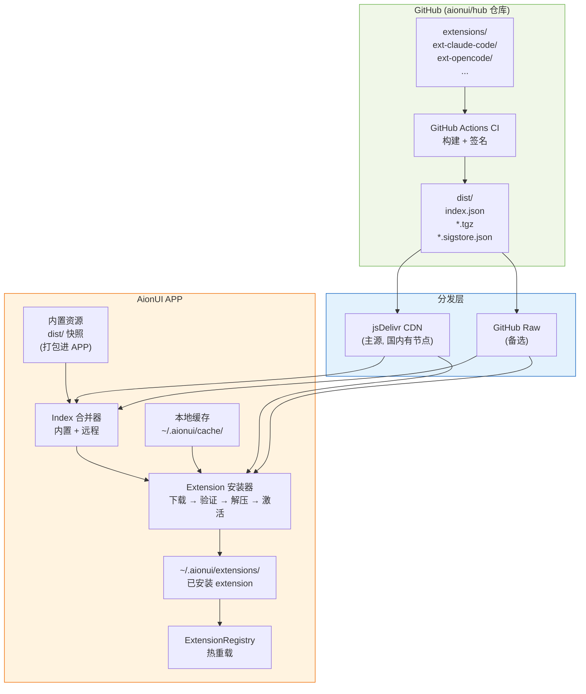

# Extension 分发管线 — 深度调研与架构方案

> 日期：2026-03-30
> 关联：[README.md](README.md) · [architecture.md](architecture.md) · [security-model.md](security-model.md) · [gap-analysis.md](gap-analysis.md)

## 目录

1. [要解决的 6 个问题](#1-要解决的-6-个问题)
2. [业界调研总结](#2-业界调研总结)
3. [Q1 — 元数据管理](#3-q1--元数据管理)
4. [Q2 — 内容存储](#4-q2--内容存储)
5. [Q3 — 版本管理](#5-q3--版本管理)
6. [Q4 — 安全审计](#6-q4--安全审计)
7. [Q5 — 签名验证](#7-q5--签名验证)
8. [Q6 — 下载机制](#8-q6--下载机制)（含 [bun 运行时注意事项](#bun-运行时注意事项)）
9. [推荐架构方案](#9-推荐架构方案)
10. [分阶段实施路线](#10-分阶段实施路线)

---

## 1. 要解决的 6 个问题

| #   | 问题       | 核心诉求                                 |
| --- | ---------- | ---------------------------------------- |
| Q1  | 元数据管理 | index.json schema、增量更新、多 Hub 索引 |
| Q2  | 内容存储   | extension 文件存哪？成本、限速、可靠性   |
| Q3  | 版本管理   | 版本策略、更新检测、回退机制             |
| Q4  | 安全审计   | 上架审核、运行时校验、恶意代码检测       |
| Q5  | 签名验证   | 完整性校验、发布者身份、防篡改           |
| Q6  | 下载机制   | 下载协议、离线 fallback、CDN、包格式     |

## 2. 业界调研总结

调研了 6 个成熟分发体系，提取各维度最佳实践：

| 维度         | npm / bun\*                | VS Code                    | Homebrew                  | Obsidian                   | Chrome                | Sigstore                 |
| ------------ | -------------------------- | -------------------------- | ------------------------- | -------------------------- | --------------------- | ------------------------ |
| **包格式**   | .tgz (gzip tarball)        | .vsix (ZIP/OPC)            | .tar.gz (bottle)          | 裸文件 (main.js)           | .crx (ZIP + 签名头)   | —                        |
| **完整性**   | SHA-512 SRI                | PKCS#7 签名                | SHA-256 (=blob 地址)      | 无                         | CRX3 签名             | SHA-256 + 证书           |
| **签名**     | Sigstore provenance (OIDC) | 服务端 X.509 签名          | 无 (仅 checksum)          | 无                         | 开发者 RSA + 商店复签 | OIDC 无密钥签名          |
| **存储**     | npm registry (CouchDB)     | Azure CDN                  | GitHub Packages (ghcr.io) | 作者 GitHub Releases       | Google CDN            | —                        |
| **版本**     | 每包独立 semver            | 每扩展独立 semver          | 每 formula 独立           | 每插件独立 (manifest.json) | 每扩展独立            | —                        |
| **更新检测** | `npm outdated`             | 客户端轮询 Marketplace API | livecheck (3h/次 CI)      | 轮询 raw.githubusercontent | 浏览器轮询 (~5h/次)   | —                        |
| **审核**     | 无强制审核                 | 人工 + 自动                | 人工 + bot                | 首次人工审核               | 自动 + 人工混合       | —                        |
| **离线**     | npm cache + lock file      | VSIX 文件直装              | bottle cache (120天)      | 已装插件离线可用           | 已装扩展离线可用      | 离线验证 (缓存 TUF root) |
| **镜像**     | npmmirror / verdaccio      | Open VSX (自托管)          | HOMEBREW_BOTTLE_DOMAIN    | 无 (依赖 GitHub)           | 无                    | —                        |

> \* **bun 与 npm 的 registry 层完全兼容**：bun 使用相同的 npm registry API (`registry.npmjs.org`)、相同的 .tgz 包格式、支持 `.npmrc` 配置和 `BUN_CONFIG_REGISTRY` 镜像切换。AionUI 已内置 bun 运行时，extension 的 `onInstall` 钩子通过 `bun add` 安装 CLI backend。与 npm 的关键差异见 [Q6 补充：bun 运行时注意事项](#bun-运行时注意事项)。

### 关键发现

1. **包格式**: .tgz 是最通用的选择 (npm, Homebrew 都用)，工具链完善，跨平台解压无障碍
2. **签名趋势**: 行业正从"密钥管理"迁移到"身份绑定" — Sigstore 已被 npm, GitHub, PyPI 采用
3. **存储**: GitHub Releases / GitHub Packages 是开源项目的零成本选择；CDN 是规模化后的必然
4. **版本管理**: 每 extension 独立版本是共识；Obsidian 的 `manifest.json` + `versions.json` 模式最轻量
5. **审核**: Chrome 的混合审核 (自动静态分析 + 人工) 是最佳实践；首次严格、更新差量分析
6. **离线**: VS Code 的 VSIX 直装模式最成熟 — 包就是自包含的安装单元

---

## 3. Q1 — 元数据管理

### 问题

index.json 的 schema 如何设计？如何支持多 Hub (Agent Hub, Skill Hub, MCP Hub...) 索引？

### 业界参考

| 项目     | Index 格式                              | 大小                | 更新方式                       |
| -------- | --------------------------------------- | ------------------- | ------------------------------ |
| LobeHub  | `index.{locale}.json` (按 locale 拆分)  | ~500 agent 约 200KB | CI 全量重建 → npm 发布         |
| Homebrew | `formula.json` (全量) + 单 formula JSON | 全量 >5MB           | CI 定时全量重建 → GitHub Pages |
| Obsidian | `community-plugins.json` (全量)         | 2700+ 条目 ~638KB   | 手动 PR 维护                   |
| npm      | 无全量 index；per-package API           | —                   | 实时 (publish 即更新)          |

### 推荐方案：单 index.json + 自动推导 Hub 分类

```jsonc
// index.json — 由 CI 自动生成
{
  "schemaVersion": 1,
  "generatedAt": "2026-03-30T12:00:00Z",
  "extensions": [
    {
      // === 身份 ===
      "name": "ext-claude-code",
      "displayName": "Claude Code",
      "version": "1.2.0",
      "description": "Anthropic Claude Code CLI agent for AionUI",
      "author": "aionui",
      "icon": "icon.png", // 相对路径, 客户端拼接

      // === 市场元数据 ===
      "tags": ["anthropic", "claude", "coding"],
      "readme": "README.md", // 相对路径
      "screenshots": ["preview.png"],

      // === 分发 ===
      "dist": {
        "tarball": "extensions/ext-claude-code/ext-claude-code-1.2.0.tgz",
        "integrity": "sha512-abc123...", // SRI hash
        "unpackedSize": 12480, // bytes
        "signature": "extensions/ext-claude-code/ext-claude-code-1.2.0.tgz.sigstore.json",
      },

      // === 兼容性 ===
      "engines": { "aionui": ">=2.0.0" },
      "dependencies": {},

      // === Hub 自动推导 (从 contributes 提取) ===
      "hubs": ["agent"], // CI 从 aion-extension.json 的 contributes 自动计算
      "contributes": {
        "acpAdapters": 1, // 只记数量, 不展开内容
        "skills": 0,
        "mcpServers": 0,
        "assistants": 0,
        "themes": 0,
      },

      // === 权限摘要 ===
      "permissions": {
        "shell": true,
        "network": false,
        "filesystem": "extension-only",
      },
      "riskLevel": "moderate",
    },
  ],

  // === Hub 索引 (自动推导, 方便客户端按 Hub 筛选) ===
  "hubs": {
    "agent": ["ext-claude-code", "ext-opencode", "ext-kimi"],
    "skill": ["ext-translator-skills"],
    "mcp": ["ext-github-mcp"],
    "theme": ["ext-dark-plus"],
  },

  // === 标签聚合 (搜索/筛选) ===
  "tags": [
    { "name": "anthropic", "count": 2 },
    { "name": "coding", "count": 5 },
  ],
}
```

### 设计决策

| 决策         | 选择                    | 理由                                                                  |
| ------------ | ----------------------- | --------------------------------------------------------------------- |
| 全量 vs 分页 | 全量                    | 初期 extension 数量少 (<100), 全量 JSON 小于 100KB, 无需分页          |
| Hub 分类方式 | 从 contributes 自动推导 | 不需要手动维护 category 字段, 不会出现分类不一致                      |
| 多 locale    | 暂不做                  | 初期不做国际化 index, 后续按需加 `index.{locale}.json`                |
| 增量更新     | 暂不做                  | 全量 index.json 足够小; 后续可加 `ETag`/`If-Modified-Since` HTTP 缓存 |

---

## 4. Q2 — 内容存储

### 问题

Extension 的实际文件 (aion-extension.json, 脚本, icon 等) 存在哪里？

### 业界方案对比

| 方案                | 代表             | 成本                  | 限速                   | 可靠性          | 适合场景         |
| ------------------- | ---------------- | --------------------- | ---------------------- | --------------- | ---------------- |
| **GitHub 仓库内**   | LobeHub, Raycast | 免费 (Git LFS 有限额) | GitHub CDN 限速        | 高 (GitHub SLA) | 小文件, 数量可控 |
| **GitHub Releases** | Obsidian         | 免费 (单文件 <2GB)    | 无 API 限速 (CDN 直下) | 高              | 独立版本发布     |
| **GitHub Packages** | Homebrew         | 免费 (公开包)         | OCI API 限速           | 高              | 预构建二进制     |
| **npm registry**    | LobeHub index    | 免费 (公开包)         | 无硬限速               | 极高            | JS 包            |
| **自建 OSS/CDN**    | VS Code, Chrome  | 有成本                | 自控                   | 自控            | 大规模商业产品   |

### 推荐方案：GitHub 仓库内 + GitHub Releases (双层)

```
aionui/hub/  (GitHub 仓库)
├── extensions/
│   ├── ext-claude-code/
│   │   ├── aion-extension.json        ← 源文件 (Git 管理)
│   │   ├── install.sh
│   │   ├── icon.png
│   │   └── README.md
│   └── ext-opencode/
│       └── ...
├── dist/                               ← CI 生成, Git 管理
│   ├── index.json                      ← 客户端拉取的索引
│   └── ext-claude-code-1.2.0.tgz      ← 打包后的 extension
├── scripts/
│   └── build.ts                        ← CI 构建脚本
└── .github/
    └── workflows/
        └── build.yml
```

**CI 构建流程**:

1. PR 合并到 main → 触发 CI
2. `scripts/build.ts` 扫描 `extensions/` 下所有目录
3. 对每个 extension: 打包为 `.tgz` → 计算 SHA-512 → 签名 (Sigstore) → 输出到 `dist/`
4. 生成 `dist/index.json`
5. commit `dist/` 回 main (或发到 GitHub Releases)

**为什么不只用 GitHub Releases**:

- 初期 extension 数量少, `dist/` 目录不大
- 方便 APP 打包时直接从仓库拷贝 `dist/` 到资源目录
- 后续如果体积增长, 可将 .tgz 迁移到 GitHub Releases (index.json 里的 tarball URL 指向 Releases), 平滑演进

**为什么不用 npm**:

- AionUI 的 extension 不是 JS 包, 发布到 npm 语义不对
- 增加了 npm 账号管理、发布流程等额外复杂度
- 自己仓库内管理更直接

---

## 5. Q3 — 版本管理

### 问题

整仓库版本 vs 每 extension 独立版本？如何检测更新？如何回退？

### 业界对比

| 项目     | 版本策略                             | 更新检测                       | 回退                            |
| -------- | ------------------------------------ | ------------------------------ | ------------------------------- |
| npm      | 每包独立 semver                      | `npm outdated` 本地比较        | `npm install pkg@version`       |
| VS Code  | 每扩展独立 semver                    | 客户端轮询 API, 批量比较       | UI "Install Another Version..." |
| Homebrew | 每 formula 独立 (版本在 Ruby 文件中) | livecheck CI 自动检测          | `brew install pkg@version`      |
| Obsidian | 每插件独立 (manifest.json)           | 轮询每插件 raw manifest        | 不支持 (需手动下载旧 release)   |
| LobeHub  | 整仓库 semver                        | 不适用 (纯 prompt, 无安装概念) | 不适用                          |

### 推荐方案：每 extension 独立 semver

```
# 版本定义在每个 extension 的 aion-extension.json 中
{
  "name": "ext-claude-code",
  "version": "1.2.0",              ← extension 版本
  "engines": { "aionui": ">=2.0.0" }  ← 兼容性声明
}
```

**更新检测流程**:

```
APP 启动 / 定期 (每 24h)
  │
  ├── 拉取远程 index.json
  │
  ├── 对比本地已安装 extension 版本
  │   for each installed ext:
  │     if remote.version > local.version
  │       AND semver.satisfies(appVersion, remote.engines.aionui)
  │       → 标记为 "可更新"
  │
  └── UI 展示 Update 按钮
```

**版本回退**:

- P0 不做自动回退
- 用户可通过卸载 → 重新安装 (APP 内置版本) 回退到内置版本
- 后续可加: 在安装新版前备份旧版到 `~/.aionui/extensions/.backup/`, 支持一键回退

**版本号规范**:

- 严格 semver (`major.minor.patch`)
- CI 校验: manifest 中的 `version` 必须大于上一次发布版本 (防止降版本覆盖)
- `engines.aionui` 使用 semver range (如 `>=2.0.0`, `^2.1.0`)

---

## 6. Q4 — 安全审计

### 问题

如何确保上架的 extension 是安全的？

### 业界审核模型对比

| 项目     | 自动检查                                        | 人工审核           | 审核时机 | 运行时执行                    |
| -------- | ----------------------------------------------- | ------------------ | -------- | ----------------------------- |
| Chrome   | 权限分析、代码混淆检测、恶意代码扫描、diff 分析 | 高风险扩展人工审核 | 每次提交 | CSP + API 权限门控 + 进程隔离 |
| VS Code  | 恶意代码扫描 (多引擎)                           | 首次发布者审核     | 每次提交 | 签名验证 + 发布者信任         |
| npm      | 无强制审核                                      | 无                 | —        | 无                            |
| Obsidian | 自动格式校验                                    | 首次 PR 审核代码   | 首次提交 | 无 (完整 Node.js 权限)        |
| Homebrew | CI 构建测试 + bot 检查                          | 人工审核 PR        | 每次提交 | 沙箱构建                      |

### 推荐方案：分层审核

```
Extension 提交 (PR)
  │
  ├── [L1] CI 自动检查 (必须全通过才能合并)
  │   ├── manifest 格式校验 (Zod schema)
  │   ├── 权限声明分析 (risk level 计算)
  │   ├── 文件结构检查 (必需文件存在性)
  │   ├── 版本号递增校验
  │   ├── engines 兼容性校验
  │   └── 包体积限制检查 (如 <5MB)
  │
  ├── [L2] CI 静态分析 (可选, 辅助人工判断)
  │   ├── lifecycle 钩子脚本内容审查 (检测危险操作: rm -rf, curl | sh 等)
  │   ├── diff 分析 (对比上一版本, 高亮变更)
  │   └── 依赖扫描 (如 extension 依赖的 npm 包是否有已知漏洞)
  │
  └── [L3] 人工审核 (PR review)
      ├── 代码 review (lifecycle 钩子、entryPoint)
      ├── 权限合理性判断 (声明的权限是否与功能匹配)
      └── 合并 → 触发 CI 构建 + 签名 + 发布
```

**运行时执行 (客户端)**:

- P0: 安装前展示权限摘要 + 风险等级 (已有 `analyzePermissions()`)
- P1: 签名验证 (确保包来自官方 CI)
- P2: 沙箱权限执行 (阻止未声明的 API 调用)

---

## 7. Q5 — 签名验证

### 问题

如何确保用户下载的 extension 包未被篡改？如何验证发布者身份？

### 业界签名方案对比

| 方案                 | 代表           | 密钥管理                    | 身份证明                            | 可审计                  | 复杂度 |
| -------------------- | -------------- | --------------------------- | ----------------------------------- | ----------------------- | ------ |
| **SHA-256 checksum** | Homebrew       | 无 (仅哈希)                 | 不证明身份                          | 否                      | 极低   |
| **GPG 签名**         | Linux 发行版   | 需管理密钥对                | 密钥持有者                          | 否                      | 中     |
| **服务端 X.509**     | VS Code        | 服务端管理证书              | 商店身份                            | 否                      | 中     |
| **CRX3 双签名**      | Chrome         | 开发者 + 商店各管理密钥     | 双方身份                            | 否                      | 高     |
| **Sigstore 无密钥**  | npm provenance | **无** (短暂密钥, 用后即毁) | OIDC 身份 (GitHub Actions workflow) | **是** (Rekor 透明日志) | 中     |

### 推荐方案：分阶段演进

#### Phase 1 (MVP): SHA-512 SRI 完整性校验

最简单，防止传输层篡改和下载损坏。

```jsonc
// index.json 中的 dist 字段
"dist": {
  "tarball": "ext-claude-code-1.2.0.tgz",
  "integrity": "sha512-2bG7Bnj3aN7z8DvP..."   // SRI format
}
```

**客户端验证**:

```typescript
import { createHash } from 'crypto';

function verifySRI(fileBuffer: Buffer, expectedIntegrity: string): boolean {
  const [algo, expectedHash] = expectedIntegrity.split('-');
  const actualHash = createHash(algo.replace('sha', 'sha')).update(fileBuffer).digest('base64');
  return actualHash === expectedHash;
}
```

**CI 生成**:

```bash
# build.ts 中
const hash = crypto.createHash('sha512').update(tgzBuffer).digest('base64');
const integrity = `sha512-${hash}`;
```

#### Phase 2: Sigstore 无密钥签名

将签名绑定到 GitHub Actions workflow 身份，证明包确实由官方 CI 构建。

**CI 签名 (GitHub Actions)**:

```yaml
permissions:
  id-token: write # Sigstore OIDC 所需

steps:
  - name: Sign extension package
    run: |
      cosign sign-blob --yes \
        --bundle dist/ext-claude-code-1.2.0.tgz.sigstore.json \
        dist/ext-claude-code-1.2.0.tgz
```

**客户端验证**:

```typescript
import { verify } from 'sigstore';

async function verifyExtension(tgzBuffer: Buffer, bundleJson: string): Promise<boolean> {
  const bundle = JSON.parse(bundleJson);
  await verify(bundle, tgzBuffer, {
    certificateIssuer: 'https://token.actions.githubusercontent.com',
    certificateIdentityRegExp: /https:\/\/github\.com\/aionui\/hub\/.*/,
  });
  return true; // 未抛异常即验证通过
}
```

**为什么选 Sigstore**:

- **零密钥管理**: 不需要生成、存储、轮换私钥
- **CI 原生**: GitHub Actions OIDC 自动提供身份令牌
- **身份绑定**: 签名绑定到具体 repo + workflow + commit, 比"谁持有密钥"更强
- **可审计**: 所有签名事件记录在 Rekor 透明日志
- **JS 库成熟**: `sigstore` npm 包支持 Node.js ≥18 (AionUI 的 Electron 满足)
- **离线验证**: bundle 文件自包含, 缓存 TUF root 后可离线验证

#### Phase 3 (远期): 社区开发者签名

当开放社区提交时, 社区开发者也可通过 Sigstore 签名 (绑定到他们自己的 GitHub Actions workflow):

```typescript
// 验证时接受多个可信身份
const trustedIdentities = [
  /https:\/\/github\.com\/aionui\/hub\/.*/, // 官方仓库
  /https:\/\/github\.com\/verified-publisher\/.*\/.*/, // 认证发布者
];
```

---

## 8. Q6 — 下载机制

### 问题

客户端如何下载 extension？断点续传？离线 fallback？CDN？包格式？

### 业界下载机制对比

| 项目     | 下载协议         | 包格式      | CDN                          | 离线策略              | 重试        |
| -------- | ---------------- | ----------- | ---------------------------- | --------------------- | ----------- |
| npm      | HTTPS GET        | .tgz        | unpkg / jsDelivr / npmmirror | npm cache + lock file | 有          |
| VS Code  | HTTPS GET        | .vsix (ZIP) | Azure CDN                    | VSIX 直装             | 有          |
| Homebrew | HTTPS GET (curl) | .tar.gz     | ghcr.io CDN                  | 本地 cache (120天)    | 5次指数退避 |
| Obsidian | HTTPS GET        | 裸文件      | GitHub Releases CDN          | 已装插件离线可用      | 未知        |
| Chrome   | HTTPS GET        | .crx (ZIP)  | Google CDN                   | 已装扩展离线可用      | 自动重试    |

### 推荐方案

#### 包格式: .tgz

```
ext-claude-code-1.2.0.tgz
└── package/                          ← 固定前缀 (防路径遍历)
    ├── aion-extension.json           ← manifest
    ├── install.sh                    ← lifecycle 钩子
    ├── icon.png
    └── README.md
```

**为什么 .tgz**:

- npm 验证过的格式, 工具链完善
- `package/` 前缀是安全惯例 (防止解压时路径遍历攻击)
- Node.js 原生 `zlib` 解压, 无需外部依赖
- 比 ZIP 更小 (gzip 压缩比优于 deflate)

#### 下载来源: 多层 fallback

```
客户端下载 extension
  │
  ├── 1. 检查内置资源 (APP 资源目录)
  │   └── 版本匹配 → 直接使用 (零网络)
  │
  ├── 2. 检查本地缓存 (~/.aionui/cache/)
  │   └── 版本匹配 + integrity 验证 → 直接使用
  │
  ├── 3. 从 GitHub 下载 (主源)
  │   ├── 优先: jsDelivr CDN (国内有节点)
  │   │   https://cdn.jsdelivr.net/gh/aionui/hub@main/dist/ext-claude-code-1.2.0.tgz
  │   │
  │   ├── 备选: GitHub Raw
  │   │   https://raw.githubusercontent.com/aionui/hub/main/dist/ext-claude-code-1.2.0.tgz
  │   │
  │   └── 备选: GitHub Releases (如果迁移到 Releases)
  │       https://github.com/aionui/hub/releases/download/v2026.03/ext-claude-code-1.2.0.tgz
  │
  ├── 4. 下载后
  │   ├── 验证 SHA-512 integrity
  │   ├── 验证 Sigstore 签名 (Phase 2)
  │   ├── 缓存到 ~/.aionui/cache/
  │   └── 解压到 ~/.aionui/extensions/ext-claude-code/
  │
  └── 5. 所有源失败
      └── 显示错误提示, 建议检查网络
```

#### 客户端下载实现要点

| 要点        | 方案                                                              |
| ----------- | ----------------------------------------------------------------- |
| HTTP 客户端 | Electron 内置 `net.request` (支持代理) 或 Node.js `https`         |
| 超时        | 连接 10s, 下载 60s                                                |
| 重试        | 3 次, 指数退避 (1s, 2s, 4s), 自动切换备选源                       |
| 断点续传    | P0 不做 (extension 包通常 <1MB); P1 可用 `Range` header           |
| 缓存        | `~/.aionui/cache/<name>-<version>.tgz`, 安装成功后保留 (方便回退) |
| 进度展示    | 下载进度通过 IPC 推送到 renderer, UI 显示进度条                   |
| 并发        | 单个 extension 串行下载; 多个 extension 可并行 (限 3 并发)        |

#### 安装流程

```
下载 .tgz 完成
  │
  ├── 1. 验证 integrity (SHA-512)
  │   └── 失败 → 删除文件, 报错
  │
  ├── 2. 验证签名 (Phase 2, Sigstore)
  │   └── 失败 → 警告用户, 可选继续
  │
  ├── 3. 解压到临时目录
  │   └── ~/.aionui/extensions/.tmp/ext-claude-code/
  │
  ├── 4. 二次校验
  │   ├── aion-extension.json 存在且合法
  │   ├── 路径安全检查 (无 symlink 逃逸)
  │   └── engines 兼容性检查
  │
  ├── 5. 原子替换
  │   ├── 旧版 → .backup/ (如果存在)
  │   └── .tmp/ → 正式目录
  │
  ├── 6. 运行 lifecycle
  │   ├── onInstall() (首次或升级)
  │   └── onActivate()
  │
  └── 7. 触发 Registry 热重载
      └── ExtensionRegistry 重新扫描 → 新 extension 生效
```

#### bun 运行时注意事项

AionUI 内置了 bun 运行时，extension 的 `onInstall` 钩子通过 `bun add` 安装 CLI backend（如 `bun add -g @anthropic-ai/claude-code`）。bun 与 npm 共用 registry API，但有以下实际差异需要在实现中处理：

| 差异                       | 影响                                                                                                                           | 应对                                                                                                                 |
| -------------------------- | ------------------------------------------------------------------------------------------------------------------------------ | -------------------------------------------------------------------------------------------------------------------- |
| **lifecycle 脚本默认阻止** | `bun add` 默认不运行依赖的 `postinstall` 等脚本（安全考虑）。部分 CLI 包依赖 postinstall 做二进制下载（如 `esbuild`、`sharp`） | extension 的 `package.json` 中声明 `trustedDependencies` 白名单；或在 `onInstall` 钩子中显式 `bun add --trust <pkg>` |
| **全局安装路径**           | `bun add -g` 装到 `~/.bun/install/global/`，bin 链接到 `~/.bun/bin/`，不在系统默认 PATH                                        | APP 启动时将内置 bun 的 globalBinDir 加入 PATH 环境变量；或用 `--globalBinDir` 指向 AionUI 管理的目录                |
| **缓存机制**               | bun 用 hardlink/COW 而非复制，缓存在 `~/.bun/install/cache/`，跨项目共享                                                       | 无需特殊处理，利好磁盘占用                                                                                           |
| **无显式 --offline**       | bun 没有 `npm --offline` 等价选项                                                                                              | 不影响：缓存命中时自动不走网络；离线场景由 APP 内置 extension 兜底                                                   |
| **registry 镜像**          | 支持 `BUN_CONFIG_REGISTRY` 环境变量、`.npmrc`、`bunfig.toml` 配置                                                              | APP 设置页提供 registry 切换选项（默认 npm 官方，可选 npmmirror 等）；`onInstall` 执行时继承 APP 配置的 registry     |

**programmatic 调用方式**:

```typescript
// main process 中调用内置 bun
import { execFile } from 'child_process';

function bunAdd(pkg: string, cwd: string): Promise<void> {
  return new Promise((resolve, reject) => {
    execFile(
      BUILTIN_BUN_PATH, // APP 内置 bun 二进制路径
      ['add', pkg, '--trust', '--no-progress', '--silent'],
      {
        cwd,
        env: {
          ...process.env,
          BUN_CONFIG_REGISTRY: getUserRegistry(), // 用户配置的 registry
        },
        timeout: 120_000, // 2 分钟超时
      },
      (err, stdout, stderr) => {
        if (err) reject(new Error(`bun add failed: ${stderr}`));
        else resolve();
      }
    );
  });
}
```

---

## 9. 推荐架构方案

### 全景图



### 各层职责

| 层               | 职责                                           | 技术选型                        |
| ---------------- | ---------------------------------------------- | ------------------------------- |
| **源 (GitHub)**  | extension 源文件管理, CI 构建/签名, index 生成 | GitHub repo + Actions           |
| **分发 (CDN)**   | 全球加速, 多源 fallback                        | jsDelivr (主) + GitHub Raw (备) |
| **客户端 (APP)** | 内置快照, index 合并, 下载/验证/安装, 缓存     | Electron main process           |

### 与现有系统的对接点

| 现有模块               | 对接方式                                                    |
| ---------------------- | ----------------------------------------------------------- |
| `ExtensionLoader`      | 安装到 `~/.aionui/extensions/` 后, 现有扫描逻辑自动发现     |
| `ExtensionRegistry`    | 安装完成后触发 `hotReload()`, 新 extension 自动注入         |
| `lifecycle.ts`         | 安装后自动运行 `onInstall()` + `onActivate()`               |
| `extensionsBridge.ts`  | 新增 `extensions.install` / `extensions.uninstall` IPC 通道 |
| `analyzePermissions()` | 安装前从 index.json 读取权限摘要, 展示给用户                |

---

## 10. 分阶段实施路线

### Phase 1 — MVP (Agent Hub)

| 步骤 | 内容                                                                                          | 依赖     |
| ---- | --------------------------------------------------------------------------------------------- | -------- |
| 1.1  | 创建 `aionui/hub` GitHub 仓库, 迁入官方 extension                                             | —        |
| 1.2  | 编写 `scripts/build.ts`: 扫描 → 打包 .tgz → 计算 SHA-512 → 生成 index.json                    | —        |
| 1.3  | 配置 GitHub Actions CI: PR merge → build → commit dist/                                       | 1.2      |
| 1.4  | APP 内置 `dist/` 快照 (构建时从 hub 仓库拷贝)                                                 | 1.3      |
| 1.5  | 客户端: IndexManager — 加载内置 index + 拉取远程 index + 合并                                 | —        |
| 1.6  | 客户端: ExtensionInstaller — 下载 .tgz → 验证 integrity → 解压 → 安装到 ~/.aionui/extensions/ | —        |
| 1.7  | IPC: 新增 `extensions.install` / `extensions.uninstall` / `extensions.check-updates` 通道     | 1.6      |
| 1.8  | UI: 在 Local Agent 页融入 Hub 列表, Install/Update 按钮                                       | 1.5, 1.7 |

### Phase 2 — 签名 + 多 Hub

| 步骤 | 内容                                                    |
| ---- | ------------------------------------------------------- |
| 2.1  | CI 增加 Sigstore 签名 (cosign sign-blob)                |
| 2.2  | 客户端增加签名验证 (sigstore-js)                        |
| 2.3  | 扩展到 Skill Hub, MCP Hub (UI 复用, index 已支持多 Hub) |
| 2.4  | 版本回退机制 (.backup/ 目录)                            |

### Phase 3 — 社区开放

| 步骤 | 内容                               |
| ---- | ---------------------------------- |
| 3.1  | PR 模板 + CI 自动审核 pipeline     |
| 3.2  | 社区 extension 贡献指南            |
| 3.3  | 沙箱权限执行 (阻止未声明 API 调用) |
| 3.4  | 评分/下载量统计 (需服务端)         |
