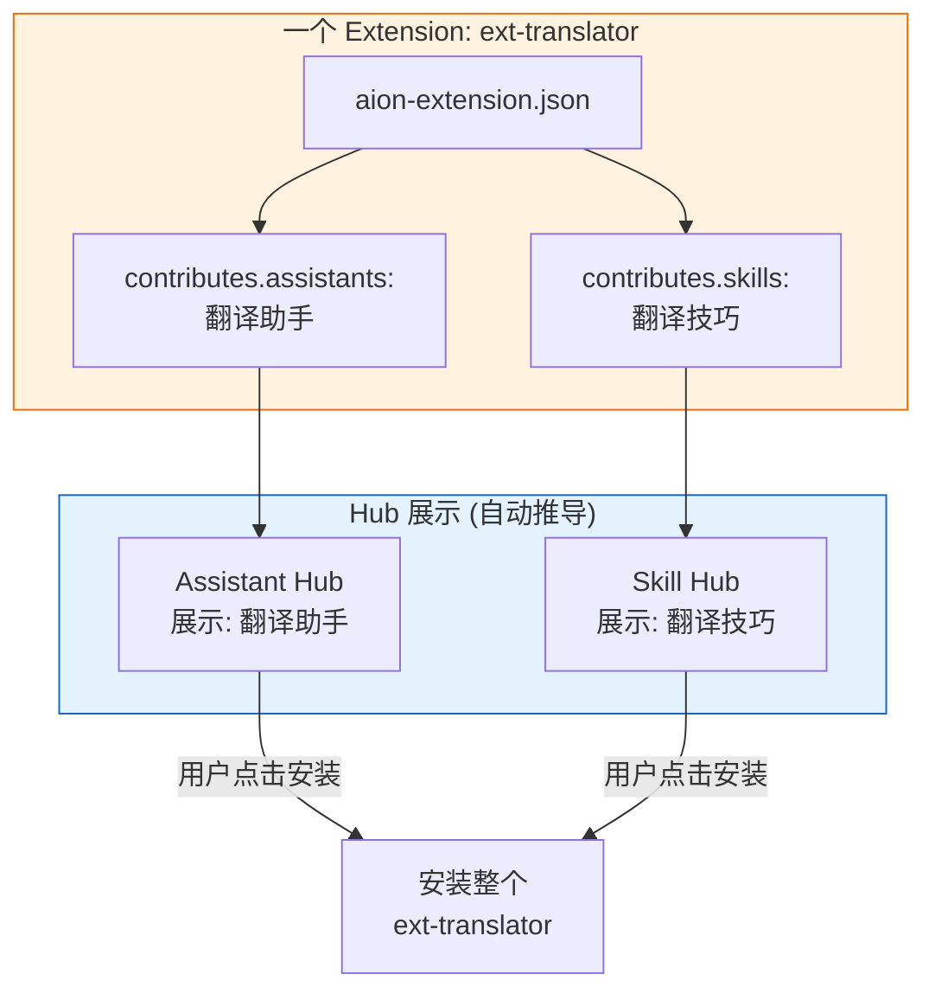
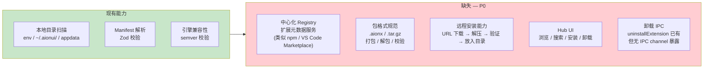
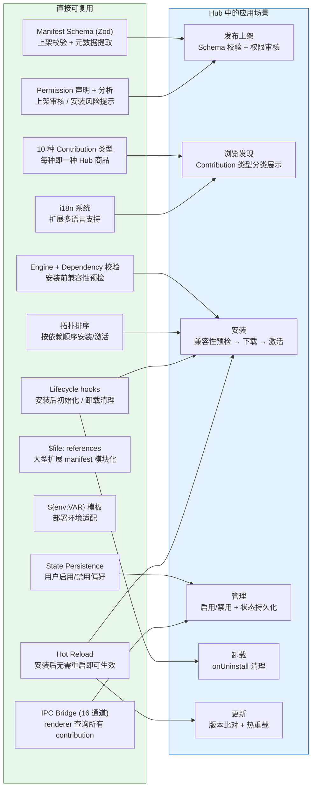
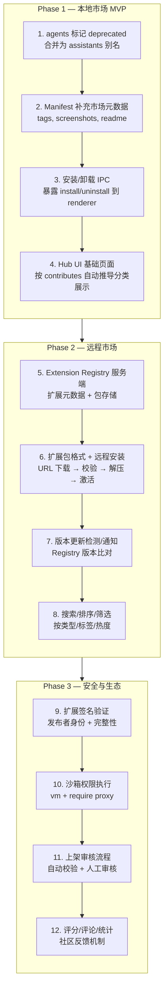

# Extension 系统 — Hub 市场化方案与 Gap 分析

> 日期：2026-03-30
> 关联：[README.md](README.md) · [architecture.md](architecture.md) · [security-model.md](security-model.md)

## 1. 核心问题

当前的 `aion-extension.json` 本质上是一个 **Extension Kit** — 一个扩展可以同时声明 10 种 contribution 类型。但市场化的需求是让用户按 contribution 粒度浏览和发现（"我要找一个翻译助手"、"我要找一个 MCP 服务器"）。

> **Hub 需要按 contribution 粒度展示和发现，但安装/分发仍然以 Extension 为单位。**
>
> 这两件事可以解耦。

## 2. 方案：保持单一 manifest，Hub 按 contributes 自动索引

不需要重构 manifest 结构，不需要引入分层模型。Hub 从 `contributes` 的实际内容自动推导分类：



**自动推导规则:**

| `contributes` 字段非空 | 出现在             |
| ---------------------- | ------------------ |
| `assistants`           | Assistant Hub      |
| `acpAdapters`          | Agent Hub          |
| `mcpServers`           | MCP Hub            |
| `skills`               | Skill Hub          |
| `themes`               | Theme Hub          |
| `modelProviders`       | Model Hub          |
| `channelPlugins`       | Channel Hub        |
| 多种                   | 同时出现在多个 Hub |

不需要 `category` 字段。后续如有需要（如标注"推荐分类"），可随时以 optional 字段加入，向后兼容无成本。

**Manifest 只需补充市场元数据:**

```jsonc
{
  // 已有字段不变
  "name": "ext-translator",
  "displayName": "翻译助手",
  "description": "...",
  "author": "...",

  // 新增 (均 optional)
  "tags": ["translation", "i18n", "multilingual"], // 搜索/筛选
  "screenshots": ["preview1.png"], // Hub 详情页
  "readme": "README.md", // Hub 详情页内容
}
```

## 3. LobeHub 对比参考

LobeHub 按独立市场拆分，每种类型一个 index repo：

| 维度           | AionUI (当前+方案)                                         | LobeHub                                            |
| -------------- | ---------------------------------------------------------- | -------------------------------------------------- |
| **单元**       | Extension (含多种 contributes)                             | 每种类型独立 (agent/plugin 各自一个 repo)          |
| **Agent 定义** | manifest → contextFile + presetAgentType + skills + models | 单个 JSON (system prompt + meta, 纯数据)           |
| **MCP**        | 嵌在 extension manifest 的 contributes 里                  | 无独立市场 repo, 用户直接配置 URL                  |
| **Plugin**     | channelPlugin + webui (需要代码)                           | 指向外部托管服务的 manifest URL                    |
| **提交门槛**   | 打包 extension 目录                                        | 单个 JSON 文件 PR                                  |
| **Index**      | 本地目录扫描 (待补远程 Registry)                           | 静态 index.json (CDN)                              |
| **安装**       | 下载整个 Extension 包                                      | Agent: 无需安装 (纯 prompt 注入); Plugin: 配置 URL |

**LobeHub 能做到纯 JSON 是因为它的 agent 就只是一段 system prompt，无代码、无文件依赖。** AionUI 的 contribution 类型更丰富（channelPlugin 需要 JS entryPoint, webui 需要 API routes, theme 需要 CSS 文件），有些天然需要打包在一起，强行拆开反而破坏内聚性。

**关键参考点:**

- LobeHub 的 Agent 市场证明了"按 contribution 粒度展示"的 UX 是成立的
- 但 AionUI 不需要照搬"每种类型独立 repo"的模式，因为 contribution 间存在耦合（如 ext-feishu 的 channelPlugin + webui）
- LobeHub 的"静态 index.json + CDN"分发模式值得借鉴，轻量且可自托管

## 4. agents 冗余分析

`agents` 作为独立 contribution 类型是冗余的：

| 对比项        | `assistants`                         | `agents`                                    |
| ------------- | ------------------------------------ | ------------------------------------------- |
| Schema        | `ExtAssistantSchema`                 | `ExtAssistantSchema` (完全相同)             |
| Resolver      | `convertAssistant(ext, 'assistant')` | `convertAssistant(ext, 'agent')` (同一函数) |
| 输出          | `_kind: 'assistant'`                 | `_kind: 'agent'`                            |
| IPC 通道      | `extensions.get-assistants`          | `extensions.get-agents` (独立通道)          |
| Registry 缓存 | `_assistants`                        | `_agents` (独立缓存)                        |
| UI 差异       | 无                                   | 无                                          |
| 功能差异      | 无                                   | 无                                          |

**清理路径:**

1. 将 `agents` 标记为 deprecated，manifest 中的 `agents` 当作 `assistants` 的别名处理（合并到同一个数组）
2. 最终移除 `agents` 的独立 IPC 通道 (`extensions.get-agents`)、独立 Registry 缓存 (`_agents`)、独立 resolver 调用 (`resolveAgents`)

## 5. Gap 分析 — 缺什么才能做市场

### 5.1 分发链路 (P0)



| Gap                 | 详细说明                                                                                           | 现有基础                                   |
| ------------------- | -------------------------------------------------------------------------------------------------- | ------------------------------------------ |
| **中心化 Registry** | 没有存储/查询扩展元数据的服务端。用户无法在线浏览可用扩展。                                        | 无                                         |
| **包格式**          | 没有 `.aionx` 或标准压缩包规范。无法从网络下载并安装一个扩展。                                     | 无                                         |
| **远程安装**        | `ExtensionLoader` 只扫描本地目录, 没有从 URL 下载 → 解压 → 放入 extensions 目录的流程。            | `getUserExtensionsDir()` 可作为安装目标    |
| **Hub UI**          | 没有扩展商店界面。目前只有 `ExtensionSettingsPage` 渲染扩展贡献的 settings tab。                   | `IExtensionInfo` IPC 类型已有基础字段      |
| **卸载通道**        | `uninstallExtension()` 函数存在 (运行 `onUninstall` 钩子), 但没有 IPC channel, renderer 无法调用。 | `lifecycle.ts` 已有 `uninstallExtension()` |

### 5.2 版本管理 (P1)

| Gap          | 详细说明                                                                        | 现有基础                        |
| ------------ | ------------------------------------------------------------------------------- | ------------------------------- |
| **更新检测** | 有 `lastVersion` 字段用于升级检测, 但没有与远程 Registry 比对检查新版本的机制。 | `needsInstallHook()` 可检测升级 |
| **版本回退** | 无法回退到旧版本, 没有版本历史记录。                                            | 无                              |
| **自动更新** | 无静默更新或更新提示机制。                                                      | 热重载可在安装后自动生效        |

### 5.3 安全信任链 (P1)

| Gap          | 详细说明                                                                                                                                                                                 | 现有基础                                                             |
| ------------ | ---------------------------------------------------------------------------------------------------------------------------------------------------------------------------------------- | -------------------------------------------------------------------- |
| **扩展签名** | 无代码签名、校验和验证。市场分发的扩展无法验证来源。                                                                                                                                     | 无                                                                   |
| **权限执行** | 权限声明仅用于 UI 展示, 运行时不强制。市场中的第三方代码不受约束。                                                                                                                       | 声明 Schema + 分析函数已有                                           |
| **沙箱完善** | Worker Thread 沙箱消息路由已修复 (PR #1991), 但未实现真正隔离 (完整 Node.js 访问), <br/>且 `createSandbox()` 未被调用。<br/>Lifecycle hooks 已迁移到 `child_process.fork()` (PR #2004)。 | 消息通道 + apiHandlers + ExtensionStorage + lifecycle 子进程隔离已有 |
| **审核流程** | 无上架审核机制 (自动或人工)。                                                                                                                                                            | 无                                                                   |

### 5.4 市场元数据 (P2)

| Gap             | 详细说明                                         | 现有基础                               |
| --------------- | ------------------------------------------------ | -------------------------------------- |
| **标签**        | Manifest 无 `tags` 字段, 无法在市场中搜索/筛选。 | 无 (方案: 新增 optional `tags` 字段)   |
| **截图/预览**   | 无 `screenshots` 字段。                          | `themes` 有 `cover` 可参考             |
| **评分/下载量** | 需要服务端支持。                                 | 无                                     |
| **发布者信息**  | `author` 为可选字符串, 无组织/认证体系。         | `author` + `homepage` 字段             |
| **README 渲染** | 无约定的扩展 README 展示机制。                   | 无 (方案: 新增 optional `readme` 字段) |

## 6. 现有可直接复用的能力



**逐项说明:**

| 现有能力                 | Hub 中如何使用                                                                       |
| ------------------------ | ------------------------------------------------------------------------------------ |
| Manifest Schema (Zod)    | 开发者提交扩展时自动校验 manifest 格式, 提取 displayName/description/icon 等展示信息 |
| 10 种 Contribution 类型  | 每种是一个 Hub 的"商品"类型, 可按类型建立独立市场或统一市场分类展示                  |
| Engine + Dependency 校验 | 安装前检查 AionUI 版本兼容性 + 依赖扩展是否已安装                                    |
| Lifecycle hooks          | `onInstall` 用于安装后初始化, `onUninstall` 用于卸载清理                             |
| State Persistence        | 记录用户对每个扩展的启用/禁用选择, 跨重启保持                                        |
| Permission 声明 + 分析   | 在市场页面展示权限徽章, 安装前向用户展示风险等级                                     |
| Hot Reload               | 安装新扩展后触发 manifest 变化, 自动热重载, 无需重启应用                             |
| `$file:` 引用            | 大型扩展可将 contributes 拆分到多个 JSON 文件, 降低单 manifest 复杂度                |
| `${env:VAR}` 模板        | 扩展可引用环境变量 (如 API key), 适配不同部署环境                                    |
| i18n 系统                | 扩展可提供多语言翻译, Hub 可根据用户 locale 展示对应语言的名称和描述                 |
| IPC Bridge (16 通道)     | 渲染器已能查询所有 contribution 数据, 可直接用于 Hub UI 数据展示                     |
| 拓扑排序                 | 有依赖关系的扩展按正确顺序安装和激活                                                 |

## 7. 示例扩展概览

当前已有 6 个示例扩展, 展示了不同复杂度和 contribution 组合:

| 扩展                    | 用途           | 使用的 Contribution 类型                                                          | 复杂度 |
| ----------------------- | -------------- | --------------------------------------------------------------------------------- | ------ |
| `hello-world-extension` | 全功能演示     | acpAdapters, mcpServers, assistants, agents, skills, themes, settingsTabs         | 高     |
| `e2e-full-extension`    | E2E 全面测试   | acpAdapters, mcpServers, assistants, skills, themes, channelPlugins, settingsTabs | 高     |
| `star-office-extension` | 活动可视化     | settingsTabs                                                                      | 低     |
| `ext-wecom-bot`         | 企业微信渠道   | channelPlugins, webui                                                             | 中     |
| `ext-feishu`            | 飞书渠道       | channelPlugins, webui                                                             | 中     |
| `acp-adapter-extension` | CodeBuddy 适配 | acpAdapters                                                                       | 低     |

**Manifest 技巧:**

- `hello-world-extension` 使用 `$file:` 引用将各 contribution 外置到 `contributes/` 子目录
- `e2e-full-extension` 所有 contribution 内联 (方便测试)
- `hello-world-extension` 是唯一声明了 `lifecycle`, `permissions`, `engine` 的示例

## 8. 建设路线建议


