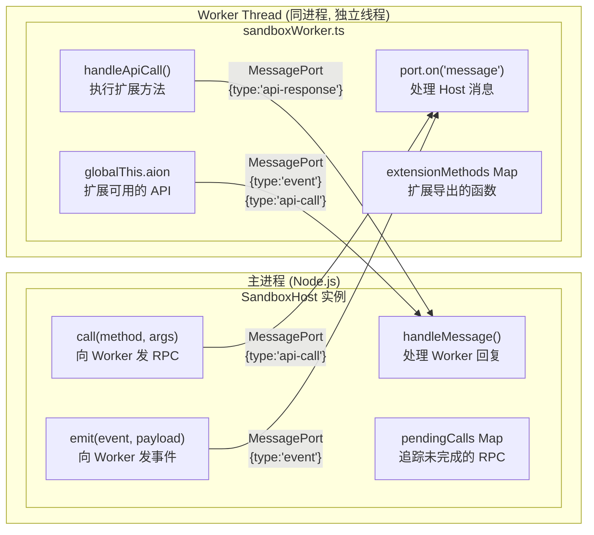
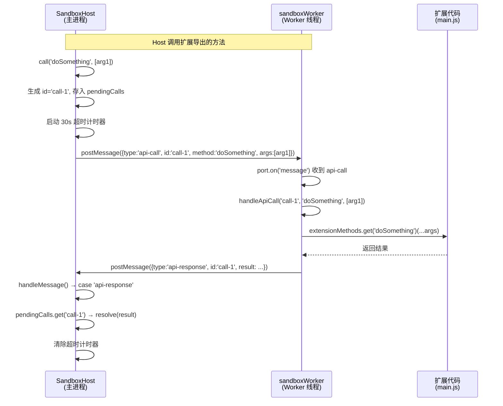
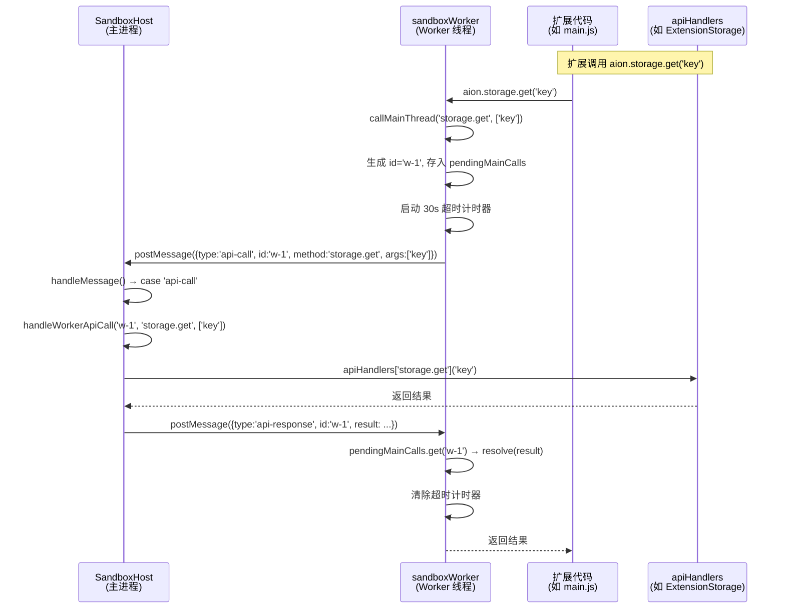
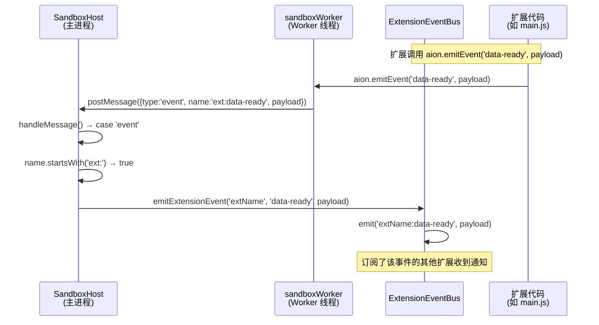
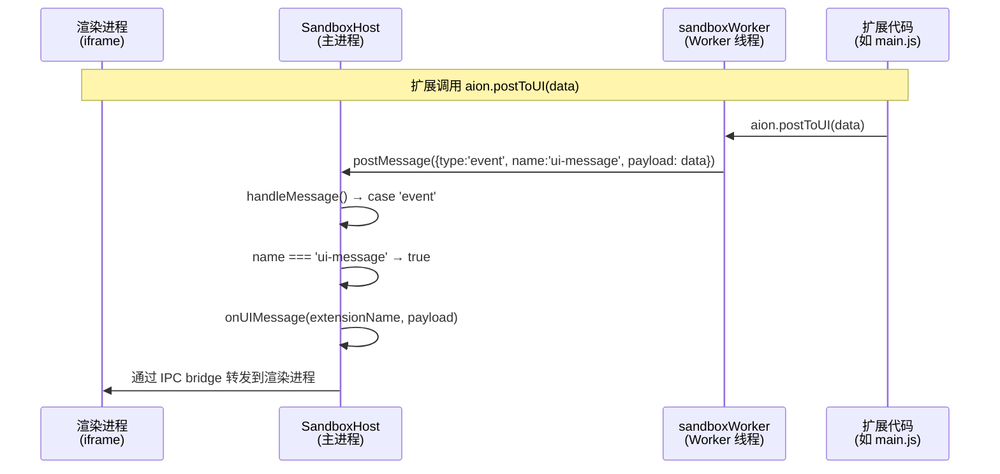
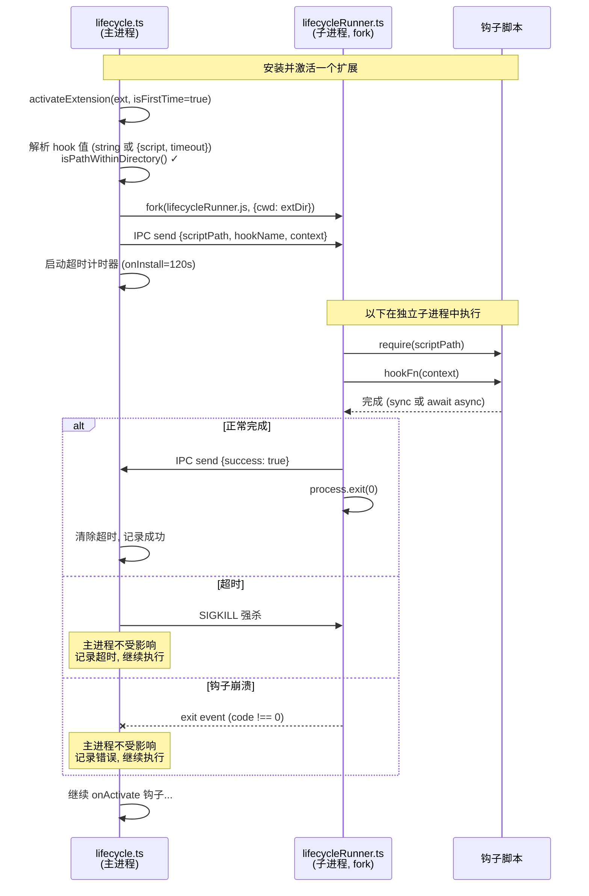
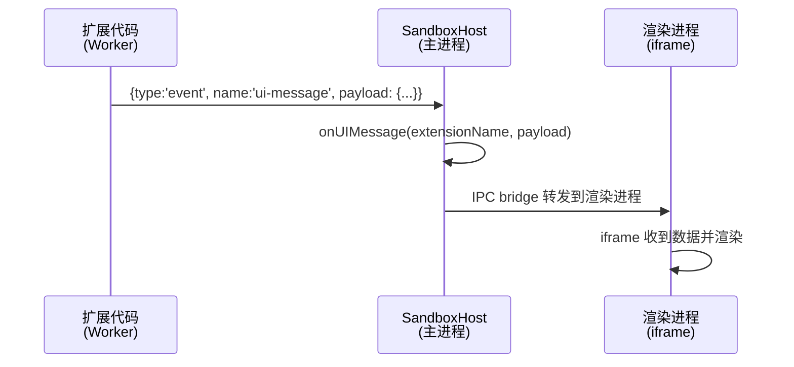
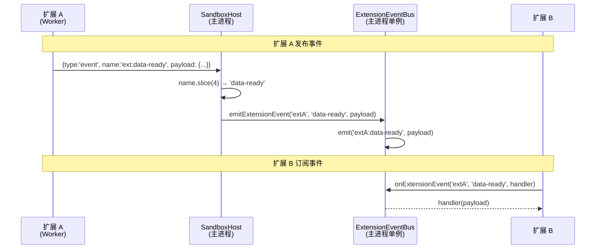

# Extension Sandbox 架构详解

> 日期：2026-03-31 (初版) · 2026-03-31 (更新: Bug #4/#5 已修复)
> 关联：[security-model.md](security-model.md) · [architecture.md](architecture.md)
> PR：[#1991](https://github.com/iOfficeAI/AionUi/pull/1991)

## 1. 进程模型总览

Electron 应用有三个层次，扩展沙箱涉及其中两个：

```
┌────────────────────────────────────────────────────────────────┐
│                     Electron 主进程 (Main Process)             │
│                                                                │
│  ┌──────────────┐  ┌──────────────┐  ┌─────────────────────┐   │
│  │ ExtRegistry  │  │ Lifecycle    │  │ SandboxHost         │   │
│  │ 扩展注册表   │  │ 生命周期管理 │  │ Worker 管理器       │   │
│  └──────────────┘  └──────────────┘  └────────┬────────────┘   │
│                                               │ Worker Thread  │
│                                       ┌───────┴────────────┐   │
│                                       │ sandboxWorker.ts   │   │
│                                       │ (扩展代码在此运行) │   │
│                                       └────────────────────┘   │
│                                                                │
├────────────────────────── IPC ─────────────────────────────────┤
│                                                                │
│                     渲染进程 (Renderer)                        │
│                     UI 界面                                    │
└────────────────────────────────────────────────────────────────┘
```

**关键概念**：Worker Thread 不是独立进程，它是主进程内部的一个**线程**。
共享同一进程的内存空间，但有独立的 V8 实例和事件循环。
通信通过 `MessagePort`（类似浏览器的 `postMessage`），不是 IPC。

---

## 2. Host 与 Worker 的关系



**一句话总结**：Host 是管理者（在主进程），Worker 是执行者（在子线程）。
它们之间所有通信都是**异步消息传递**，不能直接调用对方的函数。

---

## 3. 消息协议 — 6 种消息类型

```
消息类型          方向              用途
─────────────────────────────────────────────────────────
api-call        Host → Worker     主进程调用扩展的方法
                Worker → Host     扩展调用主进程的 API (如 storage)

api-response    Host → Worker     对应 api-call 的结果或错误
                Worker → Host     对应 callMainThread() 的结果或错误

event           Host → Worker     主进程向扩展推送事件
                Worker → Host     扩展向外发布事件 / 向 UI 发消息

log             Worker → Host     扩展的 console.log/warn/error 转发

ready           Worker → Host     Worker 初始化完成信号

shutdown        Host → Worker     主进程要求 Worker 退出
```

---

## 4. Host → Worker RPC — 主进程调用扩展方法

Host 通过 `call(method, args)` 调用 Worker 中扩展导出的方法：



---

## 5. Worker → Host RPC — 扩展调用 storage API

这是 **Worker → Host** 方向的 RPC，扩展通过 `aion.storage.*` 调用主进程服务。



**设计要点**：

- `SandboxHostOptions.apiHandlers` 是通用的 `Record<string, handler>` map，不绑定具体 API
- `ExtensionStorage.createApiHandlers(extensionName)` 生成按扩展名隔离的 storage handlers
- 无 handler 时 Host 回 error response（不静默丢弃），Worker 端 Promise reject
- Worker 端有 30s 超时保护，超时后 reject 并清理 pendingMainCalls

> **历史**: 此流程在 PR #1991 之前不工作。`handleMessage()` 缺少 `case 'api-call'`，
> Worker 发来的消息落入 `default: break` 被静默丢弃，导致 `aion.storage.*` 调用永远 hang。
> 同时 `callMainThread()` 没有超时，hang 后无法自行恢复。

---

## 6. Worker → Host 事件 — emitEvent 与 postToUI

扩展通过 `aion.emitEvent()` 和 `aion.postToUI()` 向外发送事件，
Host 按 `name` 字段路由到不同目标：





> **历史**: 此流程在 PR #1991 之前不工作。`case 'event'` 只有一个空 `break`（注释写着
> "handled by event bus" 但无任何代码），所有 Worker 发出的事件和 UI 消息都被静默丢弃。

---

## 7. 生命周期钩子 — 已迁移到子进程

> 已通过 PR #2004 迁移到 `child_process.fork()`。详见 [design-fix-sandbox.md](../design-fix-sandbox.md) 问题 4。

生命周期钩子不经过 Worker Thread Sandbox，而是 fork 独立 Node.js 子进程执行：



**Manifest 支持两种格式（向后兼容）：**

```jsonc
{
  "lifecycle": {
    "onActivate": "scripts/activate.js", // 旧格式, 用默认超时
    "onInstall": { "script": "scripts/install.js", "timeout": 180000 }, // 新格式, 自定义超时
  },
}
```

**默认超时：**

| 钩子           | 默认超时 | 理由           |
| -------------- | -------- | -------------- |
| `onInstall`    | 120s     | 可能下载二进制 |
| `onUninstall`  | 60s      | 清理操作       |
| `onActivate`   | 30s      | 轻量初始化     |
| `onDeactivate` | 30s      | 轻量清理       |

---

## 8. event 消息的两条路由 — postToUI vs emitEvent

Worker 端扩展有两个 API，都复用 `{type: 'event'}` 消息，通过 `name` 字段区分路由：

```
┌─────────────────────────────────────────────────────────────────────────────┐
│ Worker Thread (扩展代码)                                                    │
│                                                                             │
│  aion.postToUI(data)                   aion.emitEvent('data-ready', data)   │
│       │                                      │                              │
│       ▼                                      ▼                              │
│  {type:'event',                        {type:'event',                       │
│   name:'ui-message',                    name:'ext:data-ready',              │
│   payload: data}                        payload: data}                      │
└───────┬─────────────────────────────────────┬───────────────────────────────┘
        │           MessagePort               │
        ▼                                     ▼
┌───────────────────────────────────────────────────────────────────────────┐
│ SandboxHost.handleMessage() — case 'event'                                │
│                                                                           │
│  if (name === 'ui-message')              if (name.startsWith('ext:'))     │
│       │                                      │                            │
│       ▼                                      ▼                            │
│  onUIMessage 回调                       extensionEventBus                 │
│  (由调用方注入)                          .emitExtensionEvent()            │
│       │                                      │                            │
│       ▼                                      ▼                            │
│  IPC bridge → 渲染进程                  其他插件 (主进程内)               │
└───────────────────────────────────────────────────────────────────────────┘
```

### 8.1 postToUI — 扩展 → 渲染进程

用途：扩展的后端逻辑（运行在 Worker）需要向自己的 UI 前端（运行在 iframe/渲染进程）推送数据。



`onUIMessage` 是 `SandboxHostOptions` 上的回调，由创建 Sandbox 的调用方注入。
SandboxHost 自身不关心消息怎么到渲染进程，只负责把消息交给回调。

### 8.2 emitEvent — 扩展 → 其他扩展 (插件间通信)

用途：扩展 A 完成了某项工作，通知扩展 B 来消费。走 `ExtensionEventBus`。



**ExtensionEventBus 关键设计：**

| 特性     | 说明                                                               |
| -------- | ------------------------------------------------------------------ |
| 命名空间 | 事件名格式 `{extensionName}:{eventName}`，如 `pluginA:data-ready`  |
| 隔离方式 | 约定级，不强制。任何扩展都可以监听任何命名空间的事件               |
| 实现     | Node.js `EventEmitter` 子类，maxListeners=200                      |
| 作用域   | 主进程内。不跨进程，渲染进程无法直接访问                           |
| 系统事件 | 内置生命周期事件如 `extension.activated`、`extension.installed` 等 |

### 8.3 两条路由的对比

```
                    postToUI                          emitEvent
                    ────────                          ─────────
目标受众          渲染进程 (扩展自己的 UI)           其他扩展 (主进程内)
name 值           'ui-message' (固定)               'ext:{eventName}' (动态)
Host 处理方式     onUIMessage 回调                   extensionEventBus
最终到达          iframe / 渲染进程组件              其他扩展的事件监听器
跨进程?           是 (需要 IPC bridge)               否 (主进程 EventEmitter)
```

---

## 9. 完整消息流总览

```
          Host (主进程)                          Worker (子线程)
          ════════════                           ═══════════════

  ┌──────────────────────────┐              ┌──────────────────────────┐
  │                          │              │                          │
  │  call(method, args)      │──api-call──→ │  handleApiCall()         │
  │  pendingCalls.resolve    │←─api-resp─── │  extensionMethods.get()  │
  │  ✓ 正常工作              │              │  ✓ 正常工作              │
  │                          │              │                          │
  │  emit(event, payload)    │───event───→  │  eventHandlers 分发      │
  │  ✓ 正常工作              │              │  ✓ 正常工作              │
  │                          │              │                          │
  │  handleWorkerApiCall()   │←──api-call── │  callMainThread()        │
  │  → apiHandlers 路由      │              │  aion.storage.get/set    │
  │  → 回 api-response       │──api-resp──→ │  pendingMainCalls.resolve│
  │  ✓ 已修复 (PR 1991)      │              │  ✓ 30s 超时保护          │
  │                          │              │                          │
  │  case 'event' 路由:      │←───event──── │  aion.emitEvent()        │
  │  ext:* → eventBus        │              │  aion.postToUI()         │
  │  ui-message → onUIMessage│              │                          │
  │  ✓ 已修复 (PR 1991)      │              │                          │
  │                          │              │                          │
  │  console.log(prefix,...) │←────log───── │  sandboxConsole.*        │
  │  ✓ 正常工作              │              │  ✓ 正常工作              │
  │                          │              │                          │
  │  resolve start()         │←───ready──── │  初始化完成              │
  │  ✓ 正常工作              │              │  ✓ 正常工作              │
  │                          │              │                          │
  │  worker.postMessage()    │──shutdown──→ │  cleanup() + exit        │
  │  ✓ 正常工作              │              │  ✓ 正常工作              │
  └──────────────────────────┘              └──────────────────────────┘

  总结: 所有 6 种消息类型双向通信均正常工作
```

---

## 10. 剩余 TODO

| 项目                         | 现状                              | 说明                                                                     |
| ---------------------------- | --------------------------------- | ------------------------------------------------------------------------ |
| ChannelPlugin 迁移到 Sandbox | 主进程 `eval('require')`          | 代码已标 TODO，待迁移到 `createSandbox()`                                |
| ~~Lifecycle hooks 迁移~~     | ~~已迁移到 child_process.fork()~~ | ~~PR #2004, 进程级隔离 + 差异化超时 + 开发者可配置~~                     |
| `createSandbox()` 实际调用   | 无调用方                          | ChannelPlugin 迁移后才会有调用方                                         |
| `ExtensionStorage` 接入      | 已实现，未接入                    | 等 `createSandbox()` 有调用方后通过 `apiHandlers` 注入                   |
| `onUIMessage` IPC 通道       | 回调机制已就位                    | 需要实现从主进程到渲染进程的 IPC bridge                                  |
| Extension 开发者 Wiki        | 未开始                            | 需编写扩展开发文档：贡献类型、manifest 规范、`aion` API 说明、发布流程等 |
