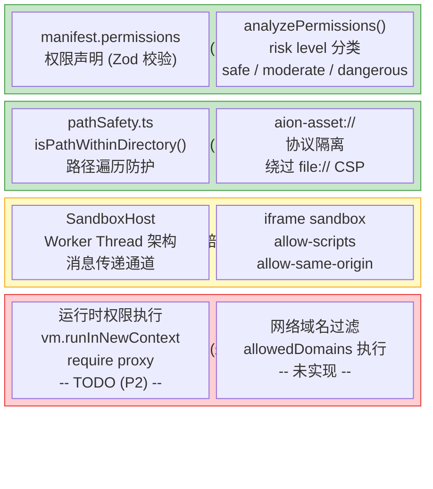
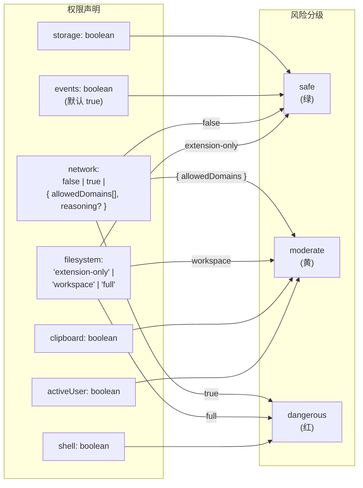
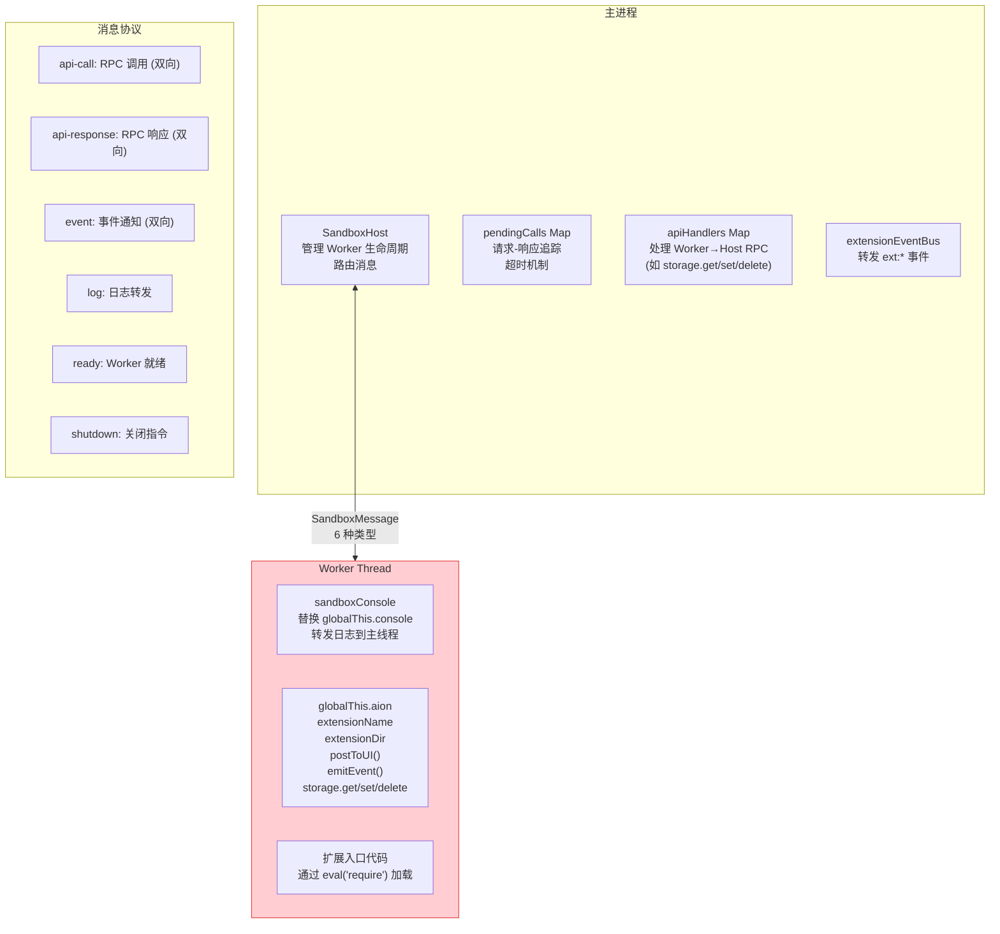
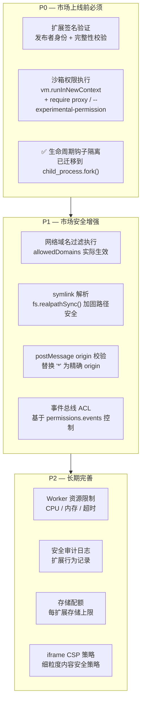

# Extension 系统 — 安全模型评估

> 日期：2026-03-30 (初版) · 2026-03-31 (更新: 沙箱 bug 修复)
> 关联：[README.md](README.md) · [architecture.md](architecture.md) · [gap-analysis.md](gap-analysis.md) · [sandbox-architecture.md](sandbox-architecture.md)

## 1. 安全架构总览



## 2. 各安全层详细评估

### 2.1 路径安全 — `pathSafety.ts`

**状态: 已实现, 可靠**

**实现:** `isPathWithinDirectory(targetPath, baseDir)`

```typescript
// 核心逻辑 (pathSafety.ts:12-27)
const resolvedTarget = path.resolve(targetPath);
const resolvedBase = path.resolve(baseDir);
// 关键: 追加路径分隔符防止前缀攻击
// /home/ext 不会误匹配 /home/ext-evil/payload
const baseWithSep = resolvedBase + path.sep;
return resolvedTarget === resolvedBase || resolvedTarget.startsWith(baseWithSep);
```

**覆盖范围:** 被以下模块调用:

| 调用方                  | 检查内容                            |
| ----------------------- | ----------------------------------- |
| `lifecycle.ts`          | 生命周期钩子脚本路径                |
| `AssistantResolver`     | contextFile + avatar 路径           |
| `SkillResolver`         | skill 文件路径                      |
| `ThemeResolver`         | CSS 文件 + cover 图路径             |
| `ModelProviderResolver` | logo 路径                           |
| `SettingsTabResolver`   | entryPoint 路径                     |
| `WebuiResolver`         | API route entryPoint + 静态资产目录 |
| `ChannelPluginResolver` | entryPoint 路径                     |
| `I18nResolver`          | localesDir + 各 locale 目录         |
| `fileResolver`          | `$file:` 引用目标路径               |

**已知限制:**

- **不解析 symlink**: 扩展目录内的 symlink 可能指向外部, `isPathWithinDirectory` 只检查逻辑路径。需要 `fs.realpathSync()` 来完全防护。
- 只检查包含关系, 不检查文件存在性或权限。

---

### 2.2 权限声明系统 — `permissions.ts`

**状态: 声明层已实现, 执行层未实现**

**声明 Schema (7 个权限):**



**风险分级详表:**

| 权限         | 值                   | 风险等级  | 说明                                      |
| ------------ | -------------------- | --------- | ----------------------------------------- |
| `storage`    | `true`               | safe      | 读写 AionUI 持久化存储                    |
| `events`     | `true`               | safe      | 跨扩展事件通信                            |
| `network`    | `false`              | safe      | 无网络访问                                |
| `network`    | `{ allowedDomains }` | moderate  | 受限域名列表 (支持 `*.github.com` 通配符) |
| `network`    | `true`               | dangerous | 不受限网络访问                            |
| `filesystem` | `extension-only`     | safe      | 仅访问扩展自身目录                        |
| `filesystem` | `workspace`          | moderate  | 访问工作区目录                            |
| `filesystem` | `full`               | dangerous | 完整文件系统访问                          |
| `clipboard`  | `true`               | moderate  | 剪贴板读写                                |
| `activeUser` | `true`               | moderate  | 访问当前用户信息                          |
| `shell`      | `true`               | dangerous | 执行系统 shell 命令                       |

**关键问题:** 这些权限**仅用于 UI 展示**。`analyzePermissions()` 返回的 `PermissionSummary[]` 仅供渲染器显示权限徽章, 实际运行时扩展代码可以自由访问所有 Node.js API。

---

### 2.3 Worker Thread 沙箱

**状态: 消息通道已修复, 隔离未完成, 未接入**

> 消息路由修复详情见 [sandbox-architecture.md](sandbox-architecture.md) 和 PR [#1991](https://github.com/iOfficeAI/AionUi/pull/1991)。



**超时保护:**

| 超时项              | 默认值 | 说明                                 |
| ------------------- | ------ | ------------------------------------ |
| `initTimeout`       | 10s    | Worker 启动到 `ready` 消息的最大等待 |
| `callTimeout`       | 30s    | Host→Worker 单次 RPC 调用的最大等待  |
| `CALL_MAIN_TIMEOUT` | 30s    | Worker→Host 单次 RPC 调用的最大等待  |
| 关闭超时            | 3s     | 优雅关闭等待, 超时后 force terminate |

**已修复问题 (PR #1991):**

1. ~~**`aion.storage` API 不可用**~~ — `handleMessage()` 已加 `case 'api-call'`，通过 `apiHandlers` map 路由到具体实现，回 `api-response`。无 handler 时回 error response 而不是静默丢弃。

2. ~~**`event` 回传通道未接通**~~ — `case 'event'` 已接入：`ext:*` 前缀转发到 `extensionEventBus.emitExtensionEvent()`，`ui-message` 走 `onUIMessage` 回调。

3. ~~**Worker→Host 调用无超时**~~ — `callMainThread()` 已加 30s 超时，超时后 Promise reject 并清理 pendingMainCalls。

**仍存在的问题:**

1. **Worker Thread 拥有完整 Node.js 权限** — `sandboxWorker.ts` 中明确标注:

   > _"Extension code runs with full Worker Thread privileges (Node.js built-ins accessible).
   > Declared permissions in the manifest are NOT enforced at runtime."_ (lines 17-22)

2. **Console 替换可绕过** — 扩展可通过 `process.stdout.write` 或 `require('console')` 绕过日志拦截。

3. **无 require 拦截** — 扩展可 `require('fs')`, `require('child_process')` 等任意内置模块。

4. **`createSandbox()` 未被调用** — ChannelPlugin 仍在主进程通过 `eval('require')` 裸跑，未迁移到 Sandbox。Lifecycle hooks 已迁移到 `child_process.fork()` 独立子进程（不经过 Sandbox，见 2.5 节）。

---

### 2.4 iframe 隔离

**状态: 已实现, 有改进空间**

**渲染策略:**

| 类型                      | 隔离方式                                             | 安全属性            |
| ------------------------- | ---------------------------------------------------- | ------------------- |
| 本地 HTML (aion-asset://) | `<iframe sandbox='allow-scripts allow-same-origin'>` | 脚本执行 + 同源访问 |
| 外部 URL (https://)       | `<webview>` + 独立 partition                         | 独立进程 + 缓存隔离 |

**已知问题:**

- `postMessage` 使用 `origin='*'`, 无来源验证
- 无消息体校验/Schema 验证
- 无消息大小限制

---

### 2.5 生命周期钩子安全

**状态: 已迁移到子进程 (child_process.fork)**

> 详见 [design-fix-sandbox.md](../design-fix-sandbox.md) 问题 4 和 PR #2004。

生命周期钩子 (`onInstall`/`onActivate`/`onDeactivate`/`onUninstall`) 已从主进程 `eval('require')` 迁移到 `child_process.fork()` 独立子进程执行：

- **进程级隔离**：钩子崩溃、`process.exit()`、native crash 不影响主进程
- **不阻塞主线程**：重操作（如 `bun add -g`）不卡 UI
- **超时保护**：按钩子类型差异化默认超时（onInstall 120s, onActivate 30s 等），开发者可在 manifest 中覆盖
- **非致命失败**：钩子失败不阻止扩展激活

**仍存在的限制**：

- 钩子代码在子进程中仍有完整 Node.js 权限（`fs`、`child_process`、`net` 等）
- 路径检查仅限脚本路径本身（`isPathWithinDirectory()`），脚本执行后无约束
- 不经过 Worker Thread Sandbox，无 `aion` API 可用

---

### 2.6 事件总线安全

**状态: 约定级, 无 ACL**

| 机制          | 现状                                         |
| ------------- | -------------------------------------------- |
| 命名空间      | `{extensionName}:{eventName}` 约定, 但不强制 |
| 监听权限      | 任何扩展可监听任何命名空间                   |
| 发送权限      | 任何扩展可向任何命名空间发送事件             |
| Listener 上限 | 200 (EventEmitter maxListeners)              |
| 速率限制      | 无                                           |

---

## 3. 安全改进路线图 (面向市场化)



## 4. 安全评估总表

| 层级         | 机制                                | 实现状态               | 市场化影响                       |
| ------------ | ----------------------------------- | ---------------------- | -------------------------------- |
| 路径安全     | `isPathWithinDirectory()`           | 已实现                 | 可靠, 需补 symlink               |
| 权限声明     | manifest `permissions` + Zod        | 已实现                 | UI 展示可用                      |
| 权限分析     | `analyzePermissions()` + risk level | 已实现                 | 市场上架/安装提示可用            |
| **权限执行** | vm / require proxy                  | **未实现 (TODO)**      | **市场化 blocker**               |
| Worker 沙箱  | Worker Thread + 消息传递            | 消息通道已修复, 未接入 | 需迁移 ChannelPlugin             |
| iframe 沙箱  | sandbox attribute                   | 已实现                 | 需加 origin 校验                 |
| 生命周期隔离 | child_process.fork()                | 已迁移到子进程         | 进程级隔离, 超时保护, 非致命失败 |
| 事件总线 ACL | —                                   | 无                     | 需按 permissions 控制            |
| 签名验证     | —                                   | 无                     | 市场信任链的基础                 |
| 网络过滤     | `allowedDomains`                    | 仅声明                 | 需执行层配合                     |
